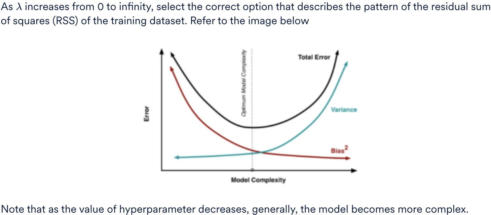

Ridge Regression is a technique for analysing multiple linear regression data that suffer from multicollinearity. When multicollinearity occurs, least squares estimates are unbiased, but their variances are large so they may be far from the true value. By adding a degree of bias to the regression estimates, ridge regression reduces the standard test errors. 

Consider a data set (split into training and test) on which you build a ridge regression model. Assume that only the raw attributes have been used and no new features have been developed for model building.

<h3>Regularization</h3>

<b>Ans :</b>Steadily increase 
<b>Explaination :</b>Differentiating the cost function with lambda=0 gives the value of the coefficients which minimizes the RSS. Again, putting λ = infinity gives us a constant model with maximum RSS. Thus, the RSS steadily increases with the variation of lambda.

As λ increases from 0 to infinity, select the correct option that describes the pattern of the variance of the model.

<b>Ans :</b>Steadily decrease 
<b>Explaination :</b>When λ=0, the alphas have their least square estimate values. The actual estimates heavily depend on the training data and hence variance is high. As we increase λ, alphas start decreasing and model becomes simpler. In the limiting case of λ approaching infinity, all betas reduce to zero and model predicts a constant and has no variance.

As λ increases from 0 to infinity, select the correct option that describes the pattern of the (squared) bias of the model.

<b>Ans :</b>Steadily increase 
<b>Explaination :</b>When λ=0, alphas have their least-square estimate values and hence have the least bias. As λ increases, alphas start reducing towards zero, the model fits less accurately to training data and hence bias increases. In the limiting case of λ approaching infinity, the model predicts a constant and hence bias is maximum.

<h3>Hyperparameter Value</h3>

You decide to use regularization to tackle this problem, that is Ridge and Lasso Regression. What will happen if we use a very large value of the hyperparameter λ?
Check all that apply.

<b>Ans :</b>
<ul>
<li>Test error will be high. 
Even though the variance will be very low, test error will be high as the model would not have captured the behaviour of the data correctly.
<li>Ridge will lead to some of the coefficients to be very close to 0. 
Ridge leads to the shrinkage of the coefficients.
</ul>

<h3>Model Correction</h3>

You have been provided with a linear regression model with RMSE = 2.8 on train data. The model provides an RMSE of 18.9 on the unseen test dataset. What would you do to correct the model?

<b>Ans :</b>Build a regularised regression model 
<b>Explaination :</b>The primary issue with the model is overfitting and the same can be solved using regularisation

<h3>Hyperparameter in Regularization</h3>

What is the hyperparameter used in regularisation? Note that the cost function for regularization is given by

<b>Ans :</b>λ 
<b>Explaination :</b>Lambda is the hyperparameter used in regularisation models

<h3>Non linear regression</h3>

Despite the nonlinearity present in the data, which method can we not use to stay in the linear regression framework to find the model coefficients.

<b>Ans :</b>In nonlinear regression, since the model coefficients are not linearly related to the response variable, linear regression framework cannot to used to estimate model coefficients. 
<b>Explaination :</b>Instead we should use polynomial regression

<h3>Data Transformation</h3>

Data transformation requires a "trial and error" approach. It is not necessary that the transformation tried will always work?

<b>Ans :</b>True 
<b>Explaination :</b>Depending on the data, the transformation we use may or may not work. Hence, it is a trial and error approach.

After transforming the data in case of nonlinear relationship between the predictor and response variable, how do we assess whether the data transformation was appropriate?

<b>Ans :</b>We assess this by checking the residual plots for any violation in assumptions. 
<b>Explaination :</b>If the model assumptions are met then we can consider that the data transformation is appropriate.

<h3>Assumptions of Linear Regression</h3>

Which of the following options describes heteroscedasticity?

<b>Ans :</b>Linear regression with a systematic change (increase or decrease) in the error terms 
<b>Explaination :</b>Heteroscedasticity is a systematic change in the spread of the residuals over the range of measured values.

<h3>R-squared</h3>

If the r^2 value given by the model is 1, should we directly deploy the model to make predictions on unseen data?

<b>Ans :</b>No 
<b>Explaination :</b>When building a model, the r^2 value gives an indication of how well the model fit the training data. r^2 value of 1 indicates the model may be overfitting the training data.

<h3>Optimisation Methods</h3>

An iterative technique like Gradient Descent is the only way, model coefficients can be estimated in Linear Regression?

<b>Ans :</b>No 
<b>Explaination :</b>Apart from Gradient Descent, Normal Equations can be used to estimate model coefficients.

<h3>RMSE</h3>

You are building a linear regression model to model the relationship between marketing spend and revenue for an FMCG company. The first model that you built gave you an RMSE of 19.34. As you are working on the problem, you build different linear regression models using different derived features. The RMSE values for these models are given below.

Which of the following combinations of features would you use in the final model?

<b>Ans :</b>(Marketing Spend)^3, (Marketing Spend)^2 
<b>Explaination :</b>Identify the model with the lowest RMSE value on unseen test data.

<h3>Residuals</h3>

If a linear regression model fits perfectly, i.e., if it has zero training error, then:

<b>Ans :</b>Cannot comment on test error. 
<b>Explaination :</b> Since the test data is unknown, we cannot comment on test error.

