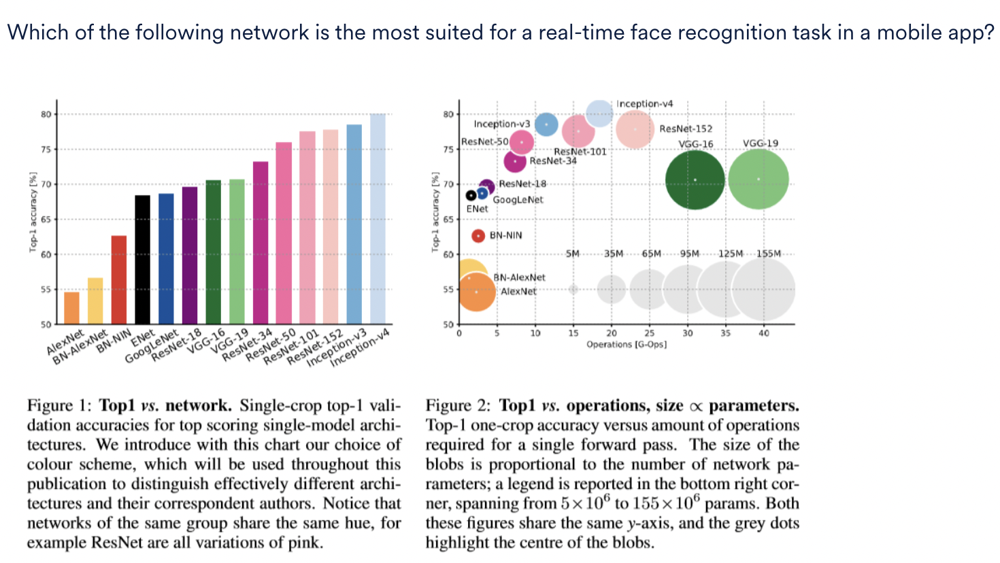

<h3>More layers</h3>

Suppose you make two CNN architectures, one with 15 layers (A) and another with 35 layers (B), and train them both (with identical infrastructure, training scheme etc.) on a 10-class classification task. The performance of the models is as follows:
<ul>
<li>Model-A: Training accuracy = 85%, validation accuracy = 82%
<li>Model-B: Training accuracy = 78%, validation accuracy = 73%
</ul>
Which of the following could be a possible explanation for these results?

<b>Ans :</b>Model-B, being huge, is difficult to train (because of issues such as vanishing/exploding gradient) 
<b>Explaination :</b>This is the most likely explanation - larger networks are harder to train. They suffer from the notorious problem of vanishing/exploding, which hamper convergence from the beginning.

<h3>Transfer Learning</h3>

In which of the following cases can we use transfer learning? More than one options may be correct.

<b>Ans :</b>
<ul>
<li>We have a massive dataset in one domain and a smaller dataset in other similar domain. 
We should definitely use transfer learning in this case since we do not have enough training data. 
<li>We have a pre-trained model in one domain and a massive dataset in other similar domain. 
We can use the pre-trained model and retrain it a little for our own purpose. Since we also have a massive dataset, the model should achieve good accuracy as well. 
<li>We have a pre-trained model in one domain and a smaller dataset in another similar domain. 
We should definitely use transfer learning in this case since we do not have enough training data.
</ul>

<h3>Learning rate in Transfer Learning</h3>

Suppose we are using the pre-trained weights from a large model and re-training our own model in a transfer learning setting. What should be the learning rate of the pre-trained weights? Assume that we can use a different learning rate for each layer. More than one options may be correct.

<b>Ans :</b>As we move from the last layer to the initial layers, we should decrease the learning rate because the initial layers are good at extracting generic features while the last few layers are usually trained for a specific task

<h3>Analysis of Deep Neural Networks</h3>

Which of the following statements are correct? More than one options may be correct.

<b>Ans :</b>The number of operations in a network is directly proportional to the inference time (i.e. the time taken for a feed-forward).
<b>Explaination :</b>The computational time is proportional to the number of operations required.

<b>Ans :</b>ENet
<b>Explaination :</b>ENet has much lesser parameters (small bubble size) than the others, so it requires much less memory. Also, the inference time is the lowest (proportional to the number of operations), which is important for a real-time task. It also has decent accuracy. 

<h3>A three-class classification CNN</h3>

Let's consider a CNN based architecture designed to classify an image into one of the three classes - a pedestrian, a tree or a traffic signal. Each input image is of size (512, 512, 3) (RGB). 

The network contains the following 11 layers in order. Note that we will address the input layer as the first layer, the next conv layer as the second layer and so on (i.e. according to the numbers). 
 
<ol>
<li> Input image (512,512,3)
<li> Convolution: 32  5x5 filters, stride 's1', padding 'p1'
<li> Convolution: 32  3x3 filters, stride 1, padding 1
<li>Max Pooling: 2x2 filter, stride 2
<li> Convolution: 64  3x3 filters, stride 1, padding 1
<li>Convolution: 64  3x3 filters, stride 1, padding 1
<li>Max Pooling: 2x2 filter, stride 2
<li>Layer 'l'
<li> Fully-connected: 4096 neurons
<li> Fully-connected: 512 neurons
<li> Fully-connected: 'F' neurons
</ol>

If the spatial dimensions (width and height) of the output going into the third layer are the same as the input from the previous layer, what can be the possible values of stride 's1' and padding 'p1'?

<b>Ans :</b>stride 1, padding 2 
<b>Explaination :</b>Calculate the output using ((n+2p-k)/s +1). With s=1, p=2, the output is (512 + 4 - 5)/1 + 1 = 512.

The 8th layer is named layer 'l'. Which of the following types could be the layer 'l'?

<b>Ans :</b>Flatten 
<b>Explaination :</b>The 'Flatten' layer connects the convolutional layer to the fully connected layer by flattening the multidimensional tensor output from the conv layer to a long vector.

What is the output from the last max pooling layer (layer 7) assuming that the width and the height do not change after the convolution operation in step-2?

<b>Ans :</b>128x128x64 
<b>Explaination :</b>After two pooling operations (starting from the starting 512 x 512), the width and the height will reduce 2 times, i.e. from 512 to 256 (in the first max pooling layer) and from 256 to 128 (in the second max pooling layer). 

What is the value of 'F' in the last layer?

<b>Ans :</b>3 
<b>Explaination :</b>Since we are classifying an image into 3 classes, it has to have 3 neurons.

Calculate the total number of trainable parameters in layer-3 (the conv layer with 32 3x3 filters)?

<b>Ans :</b>9248 
<b>Explaination :</b>The output from the previous layer is (512, 512, 32), so each filter is of size (3, 3, 32). The number of parameters is thus 32 filters *3*3*32 (weights) + 32 (biases) = 9248.

<h3>Pixel range</h3>

What is the range of possible values of each channel of a pixel if we represent each pixel with 5 bits?

<b>Ans :</b>0-31 
<b>Explaination :</b>Since we are representing each pixel by 5 bits, the total pixels will be 2^5 = 32. So the range is 0-31

<h3>Average filter</h3>

Suppose we want to take the average over a (3, 3) patch in an image using a filter. Which of the following represents the 'average filter'?

<b>Ans :</b>(1/9) ∗ [1 1 1]
                    [1 1 1]
                    [1 1 1]
 
<b>Explaination :</b>The convolution operation in this case should produce an expression like 1/n(x1+x2+x3...xn). In this case 1/n = 1/9 which is the correct factor as the average of 9 numbers will be computed by this filter at one time. Also since all the entries are 1, the convolution operation of this filter over a patch of 9*9 input will produce the sum of 9 numbers.

<h3>Convolution</h3>

<b>Ans :</b>

<h3>Trainable parameters</h3>

Which of the following layers contains trainable parameters and which does not?

<b>Ans :</b>Convolution and fully connected layers contain parameters, pooling does not. 
<b>Explaination :</b>The pooling layer does not contain any trainable parameters, Convolution and fully connected layers do. We learn the value of those parameters during backpropagation. Since pooling is just taking aggregate, there are no parameters involved in it. Say, we want to take an average of 4 numbers, we will just do (1/4) ( 4 numbers). There are no parameters that need to be learned.  Fully connected layer obviously has weights, we already know that from multilayer perceptron.

<h3>Filters</h3>

Which of the following is correct about filters in the convolutional layer? More than one options may be correct.

<b>Ans :</b>
<ul>
<li>If a filter is extracting a particular feature at one spatial location (x,y), it must be extracting the same feature at some other spatial location (x2,y2). 
Each filter extracts the same feature from different spatial locations. 
<li>Multiple different filters extract a variety of features from the same patch in an image. 
Different filters extract different features from the same patch.
</ul>

<h3>Padding</h3>

What is the advantage of padding other than to keep the spatial dimension (width and height) of the output constant?

<b>Ans :</b>If we don’t do padding then the information at the borders would be “washed away” too quickly. 
<b>Explaination :</b>Padding helps to preserve the information at the edges, otherwise, the convolution operation would extract information only from the central regions of the image .

<h3>Pooling</h3>

Which of the following statements related to pooling are correct? More than one options may be correct.

<b>Ans :</b>
<ul>
<li>
Pooling reduces the width and height of the output, thereby reducing the number of parameters and the amount of computation being done in the network. 
Pooling reduces the width and height, thereby reducing the number of parameters and the amount of computation (since with less number of parameters there will be fewer computations involved in feedforward/backpropagation etc.). 
<li>Since it reduces the number of parameters in the network, it also helps control overfitting. 
Pooling reduces the number of parameters and computation, it also controls overfitting.
<li>Pooling makes the network invariant to certain local transformations. 
Since pooling takes a statistical aggregate over multiple regions of an image, it makes the network invariant to 'local transformations' (such as the face being tilted a little, or an object being located in a different region than what the training data had seen).
</ul>

<h3>Compact representation of network</h3>

Which of the following methods can be deployed to reduce the spatial dimensions of feature maps (width and height), and thereby, to make the representation of the network more compact? More than one options may be correct.

<b>Ans :</b>
<ul>
<li>Pooling operation  
Pooling reduces the spatial dimension of the output.
<li>Convolution operation  
If we use convolution operation with stride > 1, e.g. with a filter of 2x2 and stride of 2, the output spatial dimension will reduce to half. 
</ul>

