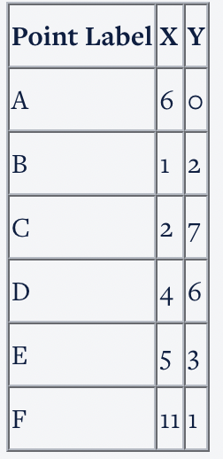

Below is given a set of 6 points which have to be clustered by agglomerative clustering method. Use the single linkage method for clustering.

<h3>Hierarchical Clustering</h3>

What is the distance between points B and E?

<b>Ans :</b>4.1 
<b>Explaination :</b>Distance is sqrt((5-1)^2 + (3-2)^2)

Select the appropriate option which describes the Single Linkage method.

<b>Ans :</b>In single linkage hierarchical clustering, the distance between two clusters is defined as the shortest distance between two points in each cluster. 
<b>Explaination :</b>Single linkage cluster takes the distance as the shortest distance between any 2 points in each of the clusters.

Based on the concept of agglomerative clustering, which two points will get clustered first?

<b>Ans :</b>C-D 
<b>Explaination :</b>The distance between C and D is sqrt(5), which is lower than any other pair of clusters.

<h3>K-Means algorithm</h3>

Select the problem sets, where k-means clustering can be applied.

<b>Ans :</b>Given an ecom company’s customer details - the products they purchased and the amount spent. The company wants to group it’s customers based on their buying behaviour. 
<b>Explaination :</b>The given option is correct. The other options are predicting the response based on independent variables.

Select the correct statement among the following:

<b>Ans :</b>The results of k-means algorithm get impacted by outliers and range of the attributes. 
<b>Explaination :</b>Depending on the initial selection of centers, the formed clusters might be different. The value of k has to be decided by the user.

Arrange the steps of k-means algorithm in the order in which they occur:
<ol>
<li>Randomly selecting the cluster centroids.
<li>Updating the cluster centroids iteratively
<li>Assigning the cluster points to their nearest center
</ol>

<b>Ans :</b>1-3-2
<b>Explaination :</b>First the cluster centers are pre-decided. Then all the points are assigned to their nearest cluster center and then the center is recalculated as the mean of all the points which fall in that cluster. Then the clustering is repeated with the new centers and the centers are updated according to the new cluster points.

Consider three cluster centres A(2,3), B(4,5) and C(6,2). A point (1,2) is to be assigned to one of these clusters. According to k-means clustering concepts and using euclidean distance as the measure of closeness, which cluster should it be assigned to?

<b>Ans :</b>A 
<b>Explaination :</b>According to k-means algorithm, the point should be assigned to the centre with the minimum distance from the point. The distances for A, B, C are sqrt(2), sqrt(18) and sqrt(25)

Which of the following options are prerequisites for k-means algorithm:
<ol>
<li>initial centers should be very close to each other
<li>Choice of number of clusters
<li>Choice of initial centroids
</ol>

<b>Ans :</b>B & C
<b>Explaination :</b>Note that the k-means algorithm requires the initial centers to be far apart.

<h3>Clustering</h3>

Which of the following are applications of clustering?

<b>Ans :</b>
<ul>
<li>Looking at social media behaviour to find out what types of online communities are there
<li>Identify consumer segments and their properties to position products appropriately
<li>Identifying patterns of crime in different regions of a city and managing police enforcement based on frequency and type of crime
<li>All the above are activities that involve looking at the data and identifying hidden patterns and properties and seeing if some data is different from other and in what aspects is it different

