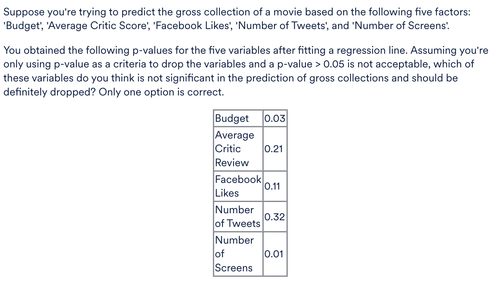
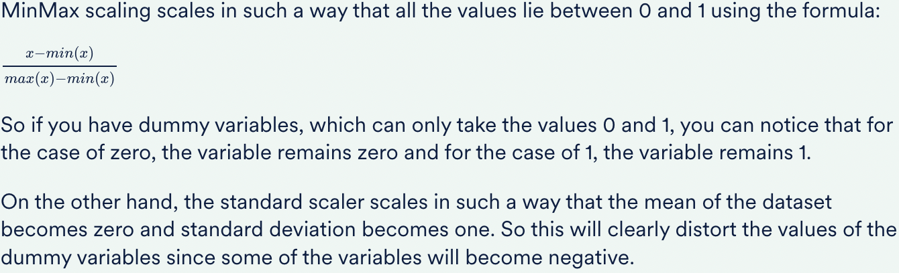
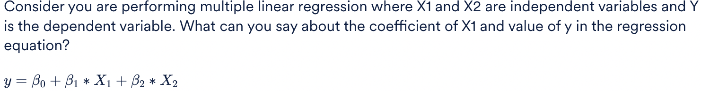

<h3>Elimination based on p-values</h3>

<b>Ans :</b> Number of Tweets 

Yes! As you can see, the p-value of 'Number of Tweets' is very high and thus, this variable is insignificant. Now, there are other variables in the list which also have a high p-value but we don't drop these simultaneously as it might happen that dropping 'Number of Tweets' might reduce the p-value of the other variables and make them significant.

<h3>Scaling Variables</h3>

Which of the following is/are true regarding the scaling of variables? More than one option(s) may be correct.
 
<b>Ans:</b>
<ul>
<li>Scaling should be done after the test-train split. 
<b>Explaination:</b>
Correct! Scaling should always be done after the test-train split since you don't want the test dataset to learn anything from the train data. So if you're performing the test-train split earlier, the test data will then have information regarding the data like the minimum and maximum values, etc.

</li>
<li>Standardised scaling will affect the values of dummy variables but MinMax scaling will not. 
<b>Explaination:</b>

</li>
</ul>

<h3>Multiple Linear Regression</h3>

<b>Ans:</b>
 The predicted value of Y increases by β1 for a unit increase in X1, given X2 does not change.
 
<b>Explaination:</b>
Consider the value of X1 changes from 0 to 1 and the value of X2 stays as 0 or a constant. Then, the value of Y would have changed by β1 units given beta2 and X2 are constants.

<h3>Rsq-Adjusted</h3>

In the R-squared Adjusted metric, R-squared is “adjusted” or modified according to:

<b>Ans:</b>
<ul>
<li>Number of predictors 

In the R-squared Adjusted formula, you can see the term ‘k’ in the denominator, where ‘k’ refers to the number of predictors or features in the model.

</li>
<li>Sample size 

In the R-squared Adjusted formula, you can see the term ‘n’ in both numerator and denominator, where ‘n’ refers to sample size.

</li>
</ul>

