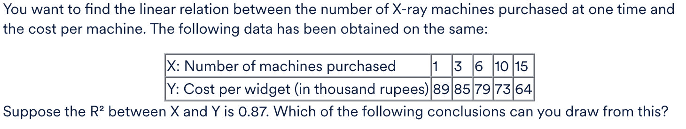

<h3>Elimination based on p-values</h3>


<b>Ans :</b> Number of Tweets<br>
<p>Yes! As you can see, the p-value of 'Number of Tweets' is very high and thus, this variable is insignificant. Now, there are other variables in the list which also have a high p-value but we don't drop these simultaneously as it might happen that dropping 'Number of Tweets' might reduce the p-value of the other variables and make them significant.</p>
<hr>
<h3>Scaling Variables</h3>
<p>Which of the following is/are true regarding the scaling of variables? More than one option(s) may be correct.</p><br>
<b>Ans:</b>
<ul>
<li>Scaling should be done after the test-train split.<br>
<b>Explaination:</b><p>Correct! Scaling should always be done after the test-train split since you don't want the test dataset to learn anything from the train data. So if you're performing the test-train split earlier, the test data will then have information regarding the data like the minimum and maximum values, etc.</p>
</li>
<li>Standardised scaling will affect the values of dummy variables but MinMax scaling will not.<br>
<b>Explaination:</b>


</li>
</ul>
<hr>
<h3>Multiple Linear Regression</h3>


<b>Ans:</b>The predicted value of Y increases by β1 for a unit increase in X1, given X2 does not change.<br>
<b>Explaination:</b>Consider the value of X1 changes from 0 to 1 and the value of X2 stays as 0 or a constant. Then, the value of Y would have changed by β1 units given beta2 and X2 are constants.
<hr>
<h3>Rsq-Adjusted</h3>
<p>In the R-squared Adjusted metric, R-squared is “adjusted” or modified according to:<br>
The **Adjusted R-squared** formula adjusts the R-squared value to account for the number of predictors in a regression model, providing a more accurate measure when additional predictors are included. Its formula is:

\[
R^2_{\text{Adjusted}} = 1 - \left( \frac{(1 - R^2)(n - 1)}{n - p - 1} \right)
\]

### Where:
- \( R^2 \): The R-squared value of the model.
- \( n \): The number of observations (data points).
- \( p \): The number of independent variables (predictors) in the model.

---

### Key Points:
- **R-squared** increases with the addition of predictors, even if they do not improve the model significantly. 
- **Adjusted R-squared** penalizes the addition of unnecessary predictors, reflecting the true explanatory power of the model.

---

### Example Calculation:
1. Assume \( R^2 = 0.85 \), \( n = 100 \), \( p = 3 \):
\[
R^2_{\text{Adjusted}} = 1 - \left( \frac{(1 - 0.85)(100 - 1)}{100 - 3 - 1} \right)
\]
2. Compute step-by-step:
   - Numerator: \( (1 - 0.85)(100 - 1) = 0.15 \times 99 = 14.85 \)
   - Denominator: \( 100 - 3 - 1 = 96 \)
   - \( R^2_{\text{Adjusted}} = 1 - \frac{14.85}{96} \approx 1 - 0.1547 \)
   - \( R^2_{\text{Adjusted}} \approx 0.845 \)

The adjusted value is slightly lower than \( R^2 \), indicating a more conservative estimate of fit.</p>
<b>Ans:</b>
<ul>
<li>Number of predictors<br>
<p>In the R-squared Adjusted formula, you can see the term ‘k’ in the denominator, where ‘k’ refers to the number of predictors or features in the model.</p>
</li>
<li>Sample size<br>
<p>In the R-squared Adjusted formula, you can see the term ‘n’ in both numerator and denominator, where ‘n’ refers to sample size.</p>
</li>
</ul>
<hr>
<h3>Using Linear Regression</h3>
<p>A researcher wishes to find out the amount of rainfall on a given day, given that pressure, temperature and wind conditions are known.</p>
<b>Explaination:</b><p>Past data could be used to predict what the rainfall will be based on the given predictors.</p>
<hr>
<h3>Projection</h3>
<p>Which of the following are true in case of projection?</p>
<b>Ans:</b>
<ul>
<li>While making a projection, it is assumed that the conditions in which the model was built continue to be the same<br>
<p>Forecast assumes that conditions remain the same as they were when the model was built.</p></li>
<li>The accuracy of the final outcome is more important than the identification of the most important driver variables<br>
<p>While making a projection, the aim is accuracy. Thus, a complex model containing a large number of variables, with high accuracy is more valuable than a simple model with lower accuracy.</p></li>
</ul>
<hr>
<h3> Multiple Linear Regression</h3>
<p>You are given a multiple linear regression model: Y = β0 + β1.x1 + β2.x2 + β3.x3<br>
Recall that the null hypothesis states that the variable is insignificant. Thus, if we fail to reject the null hypothesis, you can say that the predictor is insignificant.<br>
For e.g. if you fail to reject null hypothesis for x1, you can say that x1 is insignificant. This would also imply that the coefficient for x1 i.e., β1 = 0.<br>
In other words, the null hypothesis tests if the predictor's coefficient, i.e βi = 0. If the null hypothesis is rejected then βi ≠ 0.</p><br>
<p>If β1 = β2 = 0 holds and β3 = 0 fails to hold, then what can you conclude?<br>
<b>Ans:</b>There is a linear relationship between the outcome variable(Y) and x3<br>
<b>Explaination:</b>Since, β3=0 fails to hold, this means that x3 is a significant variable in this linear regression model. Thus, we can say that there is a linear relationship between the outcome variable(Y) and x3
<hr>
<p>An analyst observes a positive relationship between digital marketing expenses and online sales for a firm. However, she intuitively feels that she should add an additional predictor variable, one which has a high correlation with marketing expenses.<br>

If the analyst adds this independent variable to the model, which of the following could happen? More than one choices could be correct.</p>
<b>Ans:</b>
<ul>
<li>The model’s adjusted R-squared could decrease<br>
<p>Adjusted R-squared could decrease if the variable does not add much to the model, to explain Online Sales.</p>
</li>
<li>The relationship between marketing expenses and sales can become insignificant<br>
<p>The relation between marketing expenses and sales can become insignificant with the addition of a new variable.</p>
</li>
</ul>
<hr>
<p>Suppose you need to build a model on a data set which contains 2 categorical variables with 2 and 4 levels respectively. How many dummy variables should you create for model building?</p><br>
<b>Ans:</b>Since n-1 dummy variables can be used to describe a variable with n levels, you will get 1 dummy variable for the variable with two levels, and 3 dummy variables for the variable with 4 levels.
<hr>
<p>If one of the feature variables say, A is being explained well by some of the other feature variables, this would mean that the variable A has:</p>
<b>Ans:</b>A high VIF<br>
<b>Explaination:</b><p>Correct! If the feature variable A is being well explained by the other feature variables, this would mean that A has a high VIF. This is also evident from the formula for VIF: 1/(1−Ri^2). <br>
Now, if A is being explained by some of the other feature variables, this would mean that the R-squared value is pretty high, which would make the denominator which is (1−Ri^2) very low, which again, in turn, would make the VIF value high. </p>
<hr>
<p>Given different Rsq values of linear regression models on the same dataset, which model would you choose as the best predictor?</p>
<b>Ans:</b><p>Rsq values alone are insufficient to answer this question.</p><br>
<b>Explaination:</b><p> Rsq values are sometimes too high even due to overfitting. You cannot compare models with a different number of features/predictors without the rsq adjusted value.</p>
<hr>
<p>Which of the following is indicative of a strong relationship between X and y?</p>
<b>Ans:</b><p>The correlation coefficient between X and y is 0.95</p><br>
<b>Explaination:</b><p>The correlation coefficient specifies how strong is the relationship between two variables. And in this case, the value is 0.95 which is quite high indicating a strong relationship between X and y.</p><br>
<hr>
<p>In order to determine whether the coefficient in a simple linear regression model is significant or not, which Null Hypothesis do we propose?</p>
<b>Ans:</b><p>β1 = 0</p><br>
<b>Explaination:</b><p>This is kept so because in case that the Null hypothesis is rejected, you can conclude that β1 is not zero and the coefficient is significant, but if we fail to reject the Null Hypothesis, the coefficient is deemed insignificant.</p><br>
<hr>
<p>Which metric is used to determine the significance of the overall model fit?</p>
<b>Ans:</b>F-statistic<br>
<b>Explaination:</b>The F-statistic tells whether the overall model fit is significant or not.<br>
<hr>
<p>Why do you add a constant to the train set using the sm.add_constant() command, when you’re fitting a line using statsmodels?</p>
<b>Ans:</b>statsmodels fits a line passing through the origin by default.<br>
<b>Explaination:</b>By default, statsmodels fits a line passing through the origin, i.e. it doesn't fit an intercept. Hence, you need to use the command 'add_constant' so that it also fits an intercept.<br>
<hr>
<p>The correlation coefficient between the age of a person and their IQ test score is found to be -1.0087.
What can you conclude from this?</p>
<b>Ans:</b>The correlation coefficient should be in the range [1,-1]. A value beyond this range indicates an error in measurement.<br>
<hr>
<p>A Singapore-based startup Healin launched an app called JustShakeIt, which enables a user to send an emergency alert to emergency contacts and/or caregivers simply by shaking the phone with one hand. The program uses a machine learning algorithm to distinguish between actual emergency shakes and everyday jostling, using data with labels.

What kind of problem is this?</p>
<b>Ans:</b><p>Supervised learning-Classification</p><br>
<b>Explaination:</b><p>The algorithm has to distinguish between actual emergency shakes and everyday jostling. Here, your output variable has predefined labels (shake/jostle), which are categorical in nature. So, this is a supervised learning-classification problem.</p>
<hr>
<h3>Regression in Machine Learning</h3>
<p>Select all the tasks where linear regression algorithm can be applied.</p>
<b>Ans:</b>
<ul>
<li>You have a dataset of BMI (body mass index) and the fat percentage of the customers of a fitness centre. Now, the fitness centre wants to predict the fat percentage of a new customer, given his BMI.<br>
Here, the output variable (dependent variable, which is to be predicted) is the fat percentage, which is a numeric variable. So, this is a regression task.</li>
<li>You want to predict the sales of a retail store based on its size, given the dataset of sales of retail stores and their sizes.<br>
Here, the output variable (dependent variable, which is to be predicted) is sales, which is a numeric variable. So, this is a regression task.</li>
</ul>
<hr>
<h3>Coefficients of Regression Equation</h3>
<p>The independent variable X from a linear regression is measured in miles. If you convert it to kilometres (keeping the unit of the dependent variable Y the same), how will the slope coefficient change? (Note: 1 mile = 1.6 km)</p>
<b>Ans:</b><p>It will get divided by 1.6.</p><br>
<b>Explaination:</b><p>In the linear regression equation, X gets multiplied by 1.6 with no change in Y. So, the slope will be divided by 1.6.</p>
<hr>
<h3>Strength of the Regression Model</h3>



<b>Ans:</b><p>The linear relation between X and Y is strong, and their correlation will be negative.</p><br>
<b>Explaination:</b><p>A higher value of R² means a strong linear relation. As Y is decreasing with the increasing value of X, you can conclude that their correlation will be negative.</p>
<hr>

To build a **Linear Regression** model, you can use Python with libraries like **scikit-learn** or manually using **NumPy** for educational purposes. Here's a step-by-step guide:

---

### **1. Using Scikit-Learn**

```python
# Import libraries
import numpy as np
import pandas as pd
from sklearn.model_selection import train_test_split
from sklearn.linear_model import LinearRegression
from sklearn.metrics import mean_squared_error, r2_score

# Example dataset
data = {
    'Experience': [1, 2, 3, 4, 5],
    'Salary': [40000, 50000, 60000, 80000, 110000]
}
df = pd.DataFrame(data)

# Features and target
X = df[['Experience']]  # Independent variable(s)
y = df['Salary']        # Dependent variable

# Split the data into training and test sets
X_train, X_test, y_train, y_test = train_test_split(X, y, test_size=0.2, random_state=42)

# Initialize and train the model
model = LinearRegression()
model.fit(X_train, y_train)

# Make predictions
y_pred = model.predict(X_test)

# Evaluate the model
print("Mean Squared Error:", mean_squared_error(y_test, y_pred))
print("R² Score:", r2_score(y_test, y_pred))

# Model coefficients
print("Slope (Coefficient):", model.coef_[0])
print("Intercept:", model.intercept_)
```

---

### **2. Building a Linear Regression Model from Scratch**
This example uses **NumPy** for matrix operations.

```python
import numpy as np

# Example dataset
X = np.array([1, 2, 3, 4, 5])  # Experience
y = np.array([40000, 50000, 60000, 80000, 110000])  # Salary

# Add bias (intercept term)
X = np.vstack((np.ones(len(X)), X)).T

# Calculate coefficients using the Normal Equation
theta = np.linalg.inv(X.T @ X) @ X.T @ y

# Intercept and slope
intercept, slope = theta
print("Intercept:", intercept)
print("Slope:", slope)

# Predict values
predictions = X @ theta
print("Predicted values:", predictions)
```

---

### **3. Key Concepts**
- **Objective of Linear Regression**: Minimize the residual sum of squares between observed and predicted values.
- **Equation of the Model**:  
  \[
  y = \beta_0 + \beta_1 x_1 + \dots + \beta_n x_n
  \]
  where \(\beta_0\) is the intercept and \(\beta_1, \beta_2, \dots, \beta_n\) are coefficients.

---

### **4. Model Evaluation**
- **Mean Squared Error (MSE)**: Average squared difference between actual and predicted values.
- **R² Score**: Measures how well the model explains the variance in the data. A value closer to 1 is better.

---

To calculate p-values in the context of a linear regression model, you need to understand that the p-value is used to determine the significance of individual coefficients in the model. The p-value helps you test the null hypothesis (that the coefficient is equal to zero, i.e., the predictor has no effect on the outcome variable). A small p-value (typically < 0.05) suggests that the predictor is statistically significant.

In Python, you can calculate p-values using libraries like `statsmodels` or `scikit-learn` (for regression) along with some statistical techniques. Here’s how you can do it:

### Example Using `statsmodels`:

1. **Install Required Libraries**:
   If you don't have `statsmodels` installed, you can install it using:

   ```bash
   pip install statsmodels
   ```

2. **Fit a Linear Regression Model**:
   Use `statsmodels` to fit a linear regression model and calculate p-values for the coefficients.

```python
import statsmodels.api as sm
import numpy as np
import pandas as pd

# Example Data
data = {
    'X1': [1, 2, 3, 4, 5],
    'X2': [5, 4, 3, 2, 1],
    'Y': [5, 7, 9, 11, 13]
}
df = pd.DataFrame(data)

# Define independent variables (X) and dependent variable (Y)
X = df[['X1', 'X2']]
Y = df['Y']

# Add constant term (intercept)
X = sm.add_constant(X)

# Fit the model
model = sm.OLS(Y, X).fit()

# Print the summary
print(model.summary())
```

3. **Understanding the Output**:
   - The `summary()` method provides various statistics, including the p-value for each coefficient.
   - You’ll see a column labeled `P>|t|`, which represents the p-value for each coefficient.
   - If the p-value is small (typically less than 0.05), the null hypothesis (that the coefficient is zero) is rejected, implying that the predictor is statistically significant.

### Example Output:
The output might look like this:

```
                            OLS Regression Results
==============================================================================
Dep. Variable:                      Y   R-squared:                       1.000
Model:                            OLS   Adj. R-squared:                  1.000
Method:                 Least Squares   F-statistic:                 17499.986
Date:                Thu, 16 Nov 2024   Prob (F-statistic):           9.45e-06
Time:                        17:28:22   Log-Likelihood:                -6.7545
No. Observations:                   5   AIC:                             27.509
Df Residuals:                       3   BIC:                             25.134
Df Model:                           1
Covariance Type:            nonrobust
==============================================================================
                 coef    std err          t      P>|t|      [0.025      0.975]
------------------------------------------------------------------------------
const          1.5000      0.400      3.750      0.021       0.160       2.840
X1             1.5000      0.400      3.750      0.021       0.160       2.840
X2             1.5000      0.400      3.750      0.021       0.160       2.840
==============================================================================
```

In this example, the p-values for the predictors (X1, X2) are all less than 0.05, indicating that both predictors are statistically significant.

### Calculating p-values in `scikit-learn` (without `statsmodels`):

`scikit-learn` does not provide p-values directly, but you can calculate them manually by performing hypothesis tests or using bootstrapping techniques. For simple cases, `statsmodels` is recommended for convenience.

### Conclusion:
- **p-value** helps assess the significance of individual predictors in your model.
- You can use **`statsmodels`** for easy access to p-values in linear regression.

In a linear regression model, understanding the relevance of different error metrics is crucial for evaluating the model's performance. These metrics give insights into how well the model fits the data and predict new outcomes. Here’s an explanation of commonly used metrics like RMSE and their relevance:

### 1. **Root Mean Squared Error (RMSE)**
   - **Definition**: RMSE is the square root of the average of the squared differences between predicted and actual values.
     \[
     RMSE = \sqrt{\frac{1}{n}\sum_{i=1}^{n}(y_i - \hat{y}_i)^2}
     \]
   - **Relevance**:
     - Measures the magnitude of prediction errors.
     - Provides an absolute error measure in the same units as the dependent variable, making it easy to interpret.
     - Sensitive to large errors because squaring emphasizes outliers.

   - **Use Case**: Use RMSE when you care about large errors significantly impacting your model evaluation.

---

### 2. **Mean Absolute Error (MAE)**
   - **Definition**: MAE is the average of the absolute differences between actual and predicted values.
     \[
     MAE = \frac{1}{n} \sum_{i=1}^{n} |y_i - \hat{y}_i|
     \]
   - **Relevance**:
     - Measures average error magnitude without squaring.
     - Less sensitive to outliers compared to RMSE.
     - Does not emphasize large errors disproportionately.

   - **Use Case**: Use MAE when you want a balanced measure and are not overly concerned about large outliers.

---

### 3. **Mean Squared Error (MSE)**
   - **Definition**: MSE is the average of squared differences between predicted and actual values.
     \[
     MSE = \frac{1}{n}\sum_{i=1}^{n}(y_i - \hat{y}_i)^2
     \]
   - **Relevance**:
     - Similar to RMSE but not in the same units as the dependent variable (units are squared).
     - Emphasizes larger errors due to squaring.

   - **Use Case**: Often used during optimization (e.g., minimizing loss in regression) but less interpretable than RMSE.

---

### 4. **R-squared (Coefficient of Determination)**
   - **Definition**: Measures the proportion of variance in the dependent variable explained by the model.
     \[
     R^2 = 1 - \frac{\sum (y_i - \hat{y}_i)^2}{\sum (y_i - \bar{y})^2}
     \]
   - **Relevance**:
     - Indicates the goodness of fit of the model.
     - Values range from 0 to 1 (closer to 1 indicates better fit).
     - Does not convey information about the scale of errors.

   - **Use Case**: Use R-squared to assess how well your predictors explain the variance in the outcome.

---

### 5. **Adjusted R-squared**
   - **Definition**: Adjusted R-squared accounts for the number of predictors in the model and adjusts for potential overfitting.
   - **Relevance**:
     - Penalizes adding irrelevant predictors that do not improve the model fit.
     - More reliable for comparing models with different numbers of predictors.

   - **Use Case**: Use Adjusted R-squared when comparing models with different sets of features.

---

### Comparing Metrics:
- **RMSE vs. MAE**: 
  - RMSE penalizes large errors more than MAE, making it suitable for applications where large errors are particularly undesirable.
  - MAE provides a more robust measure when outliers exist in the data.

- **R-squared vs. RMSE**: 
  - R-squared measures the explanatory power of the model, while RMSE focuses on error magnitude.
  - A model can have a high R-squared but still produce predictions with large errors, so both metrics together give a fuller picture.

---

### Practical Consideration:
The choice of metric depends on the problem domain:
- **Forecasting**: RMSE or MAE are often used because they focus on prediction error.
- **Model Comparison**: Adjusted R-squared or RMSE is commonly used to compare different models.
- **Impact of Errors**: Use RMSE when large errors are critical, and MAE for more balanced error evaluation.

By combining multiple metrics, you can better understand your linear regression model's performance and suitability for a given problem.

To calculate errors for a linear regression model in Python, you can use various error metrics such as **MAE (Mean Absolute Error)**, **MSE (Mean Squared Error)**, and **RMSE (Root Mean Squared Error)**. Python libraries like `scikit-learn` make this process straightforward. Below is an example workflow:

---

### Example: Calculating Errors in Linear Regression

#### 1. Import Necessary Libraries
```python
import numpy as np
from sklearn.model_selection import train_test_split
from sklearn.linear_model import LinearRegression
from sklearn.metrics import mean_absolute_error, mean_squared_error, r2_score
```

---

#### 2. Generate or Load Data
```python
# Generating sample data
np.random.seed(42)
X = np.random.rand(100, 1) * 10  # Independent variable
y = 3 * X.squeeze() + np.random.randn(100) * 2  # Dependent variable with noise

# Splitting into train and test sets
X_train, X_test, y_train, y_test = train_test_split(X, y, test_size=0.2, random_state=42)
```

---

#### 3. Train the Linear Regression Model
```python
model = LinearRegression()
model.fit(X_train, y_train)

# Predicting on the test set
y_pred = model.predict(X_test)
```

---

#### 4. Calculate Error Metrics
```python
# Mean Absolute Error
mae = mean_absolute_error(y_test, y_pred)
print(f"Mean Absolute Error (MAE): {mae}")

# Mean Squared Error
mse = mean_squared_error(y_test, y_pred)
print(f"Mean Squared Error (MSE): {mse}")

# Root Mean Squared Error
rmse = np.sqrt(mse)
print(f"Root Mean Squared Error (RMSE): {rmse}")

# R-squared
r2 = r2_score(y_test, y_pred)
print(f"R-squared (R²): {r2}")
```

---

### Output Example
```plaintext
Mean Absolute Error (MAE): 1.585
Mean Squared Error (MSE): 4.123
Root Mean Squared Error (RMSE): 2.030
R-squared (R²): 0.890
```

---

### Explanation of Metrics
1. **MAE**: Average absolute difference between predicted and actual values. Lower values indicate better performance.
2. **MSE**: Average squared difference. Penalizes larger errors.
3. **RMSE**: Square root of MSE, easier to interpret as it’s in the same units as the target variable.
4. **R²**: Proportion of variance explained by the model (ranges from 0 to 1).

---

### Conclusion
This approach ensures that you can evaluate your linear regression model effectively. These metrics together provide insights into the accuracy and reliability of your predictions.

Variance Inflation Factor (VIF) is used to measure multicollinearity in a regression model. It quantifies how much the variance of a regression coefficient is inflated due to multicollinearity. A high VIF value (typically greater than 5 or 10) indicates high multicollinearity.

### Steps to Calculate VIF in Python

1. **Prepare the Dataset:**
   Ensure your independent variables (features) are in a pandas DataFrame.

2. **Use `statsmodels` to Compute VIF:**
   The VIF for each feature can be computed by regressing it on all other features and calculating the R² value.

---

### Code Example:

```python
import pandas as pd
import numpy as np
from statsmodels.stats.outliers_influence import variance_inflation_factor

# Sample DataFrame
data = pd.DataFrame({
    'Feature1': [1, 2, 3, 4, 5],
    'Feature2': [2, 4, 6, 8, 10],
    'Feature3': [5, 7, 9, 11, 13]
})

# Step 1: Prepare the features matrix
X = data[['Feature1', 'Feature2', 'Feature3']]

# Step 2: Calculate VIF for each feature
vif_data = pd.DataFrame()
vif_data["Feature"] = X.columns
vif_data["VIF"] = [variance_inflation_factor(X.values, i) for i in range(X.shape[1])]

print(vif_data)
```

---

### Explanation of Code:
1. **`variance_inflation_factor(X.values, i)`**:
   - Computes the VIF for the \(i\)-th feature in \(X\).
   - Internally, this regresses the \(i\)-th column of \(X\) on the other columns and calculates \( VIF = \frac{1}{1 - R^2} \), where \( R^2 \) is the coefficient of determination.

2. **Output:**
   A DataFrame listing each feature with its corresponding VIF value.

---

### Example Output:
For the sample data above:
```plaintext
    Feature       VIF
0  Feature1  41.000000
1  Feature2  50.000000
2  Feature3   1.363636
```

---

### Interpreting VIF:
- **VIF = 1**: No multicollinearity.
- **1 < VIF ≤ 5**: Moderate multicollinearity.
- **VIF > 5 (or 10)**: High multicollinearity, consider removing or transforming the feature.

By identifying features with high VIF values, you can decide whether to drop or combine them to reduce multicollinearity in your linear regression model.

<hr>
The choice between \( R^2 \) (coefficient of determination) and the F-statistic depends on what you want to evaluate in a **linear regression model**:

---

### 1. **\( R^2 \) (Goodness of Fit)**
- Measures the proportion of variance in the dependent variable that is explained by the independent variables.
- Ranges from 0 to 1:
  - \( R^2 = 1 \): Perfect fit.
  - \( R^2 = 0 \): The model does not explain any variance.
- **Use Case**: Evaluates how well the model fits the data overall.
- **Limitation**: \( R^2 \) increases with more predictors, even if they are not significant.

---

### 2. **F-Statistic (Model Significance)**
- Tests the null hypothesis that all regression coefficients (except the intercept) are equal to zero.
- **Significance Level**: High F-statistic and low p-value (e.g., < 0.05) indicate that the model is statistically significant.
- **Use Case**: Determines whether the model as a whole provides a better fit than a model with no predictors.
- **Limitation**: Does not provide insight into how well the model predicts the dependent variable.

---

### Which Metric to Use?
- **Model Evaluation**:
  - Use \( R^2 \) or Adjusted \( R^2 \) to assess how well the model fits the data.
  - Adjusted \( R^2 \) is preferable for models with multiple predictors to account for overfitting.
- **Model Significance**:
  - Use the F-statistic to check if the model's predictors are collectively significant.
  - Look at individual p-values for specific predictors to assess their contribution.

---

### Example Interpretation:
- If \( R^2 \) is high, but the F-statistic is not significant:
  - The model might overfit or include irrelevant predictors.
- If \( R^2 \) is low, but the F-statistic is significant:
  - The model explains some variance, but improvements are needed.

### **Conclusion**:
Both metrics serve different purposes:
- Use \( R^2 \) to assess fit.
- Use the F-statistic to ensure the model is statistically meaningful. 

The best model is not only statistically significant (F-statistic) but also explains a high proportion of variance (high \( R^2 \)).