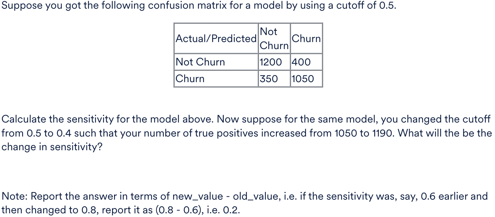
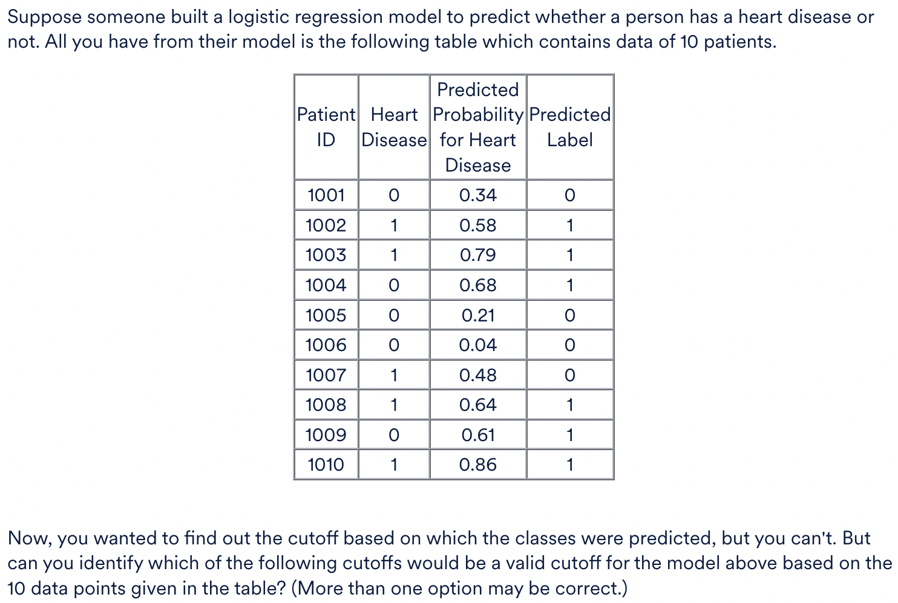
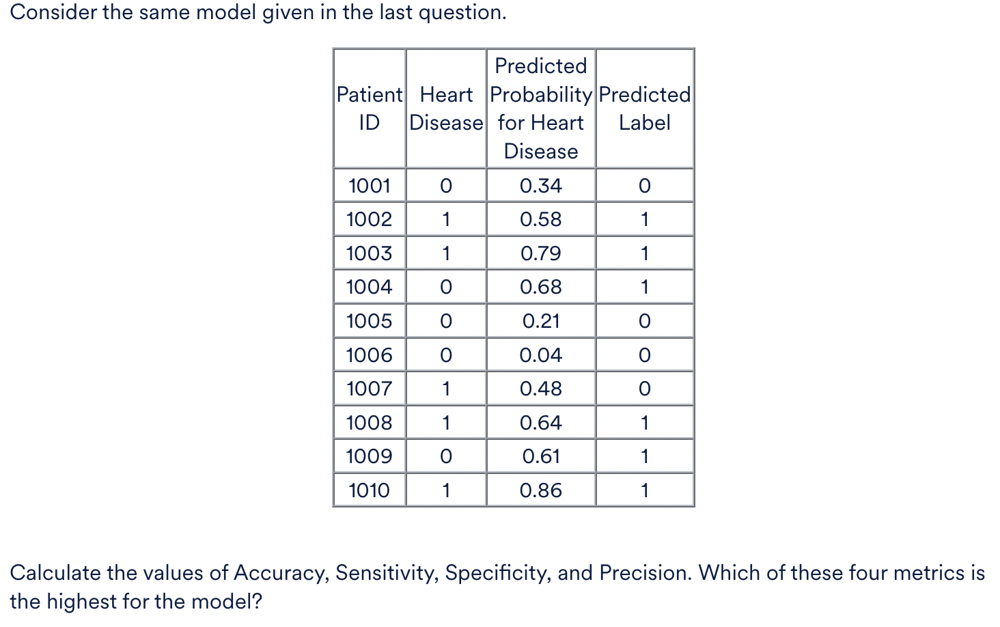
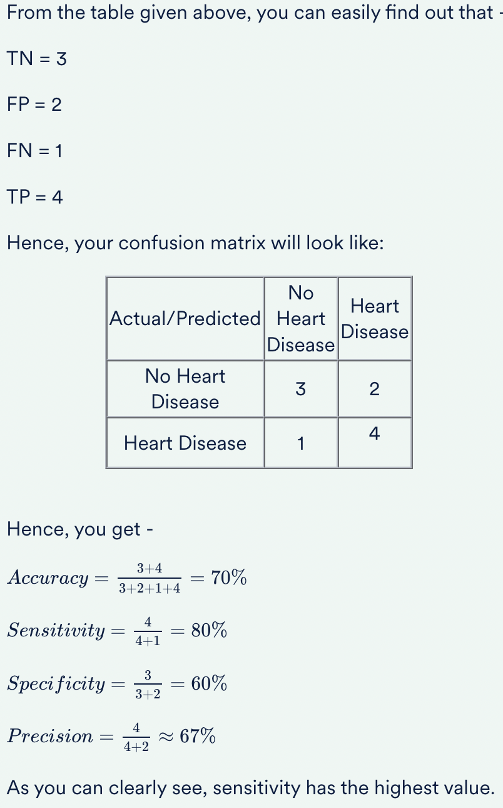
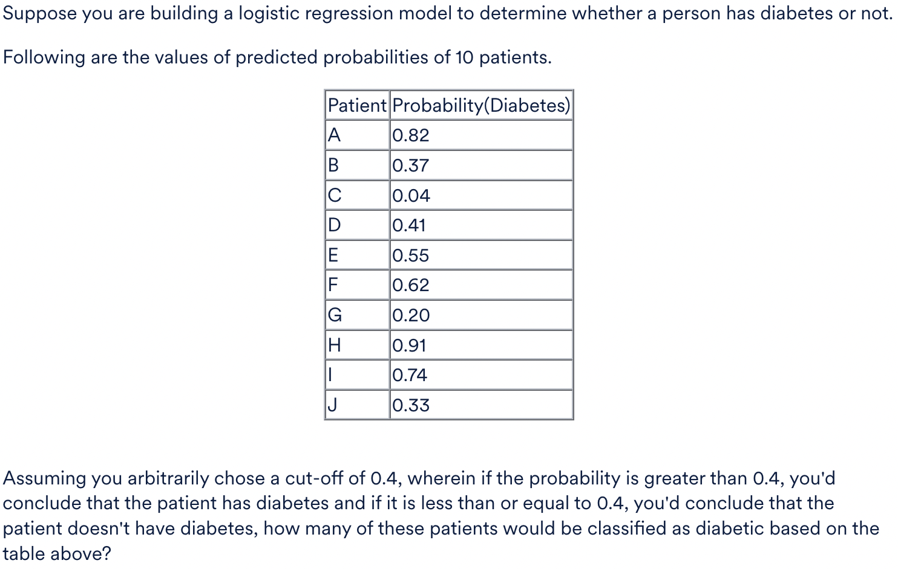
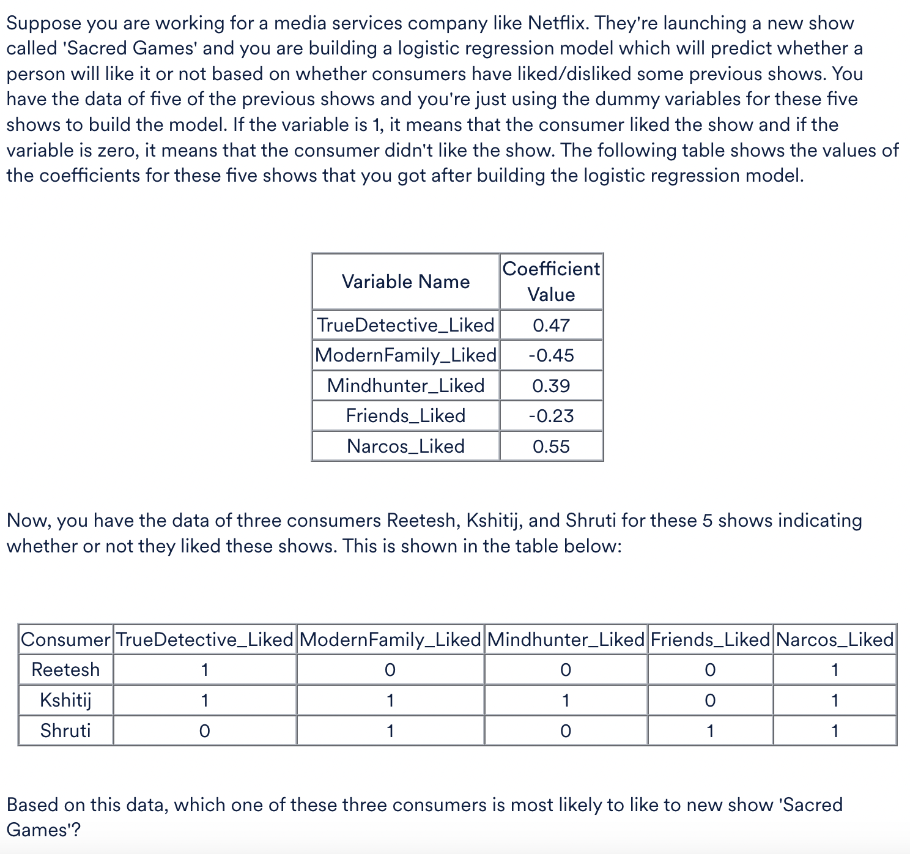
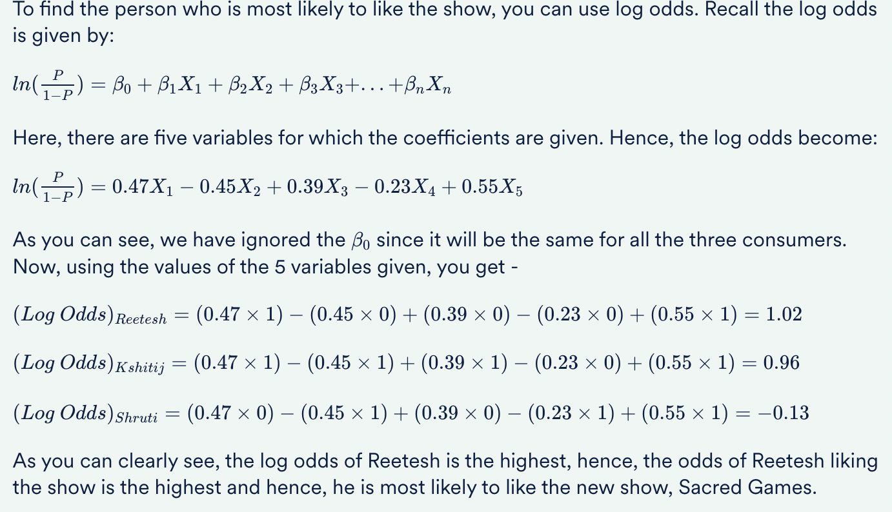

<h3>Calculating Sensitivity</h3>

<b>Ans :</b> 0.1 
<b>Explaination :</b>
Recall that the formula for sensitivity is given by - 

Sensitivity = TP/(TP+FN) 

Here, TP = 1050 and FN = 350 

Hence, initially, the sensitivity was - 

Sensitivity = 1050/(1050+350)=75% 

Now, when you changed the threshold, the number of true positives changes from 1050 to 1190. Now, since the number of actual positives will be the same always, i.e. (1050 + 350 = 1400) from the original confusion matrix, you can now calculate the new sensitivity as -  

Sensitivity =1190/1400=0.85 

Hence, the change in sensitivity = 0.85 - 0.75 = 0.1

<h3>Calculating Precision</h3>

 Consider the confusion matrix you had in the last question. Calculate the values of precision and recall for the model and determine which of the two is higher.

<b>Ans :</b> Recall 
<b>Explaination :</b>
Recall that precision and recall are given by - 

Precision=TP/(TP+FP) 

Recall=TP/(TP+FN) 

Here, TP = 1050; FP = 400; FN= 350 

Hence, you get - 

Precision=1050/(1050+400) ≈ 72.41% 

Recall=1050/(1050+350) ≈ 75% 

As you can see, of the two, recall is higher.

<h3>True Positive Rate</h3>

 The True Positive Rate (TPR) metric is exactly the same as?

<b>Ans :</b> Sensitivity 
<b>Explaination :</b>
Recall the formula for TPR is given as: 

TPR = True Positives / Total Number of Actual Positives 

Which can be rewritten as - 

TPR = TP / (TP + FN) 

And this is exactly the same as sensitivity as you might remember.

<h3>Threshold</h3>

<b>Ans :</b>
<ul>
<li>  0.50  
See the table carefully. For patient 1007, the predicted probability is 0.48 and the predicted class is 0. This means that the cutoff has to be greater than 0.48. Also, for patient 1002, the predicted probability is 0.58 and the predicted class is 1. This means that the cutoff has to be lesser than 0.58. 

Therefore, the cutoff can lie between 0.48-0.58 and hence, 0.50 are 0.55 can be valid cutoffs for the model above.
</li>
<li> 0.55  
See the table carefully. For patient 1007, the predicted probability is 0.48 and the predicted class is 0. This means that the cutoff has to be greater than 0.48. Also, for patient 1002, the predicted probability is 0.58 and the predicted class is 1. This means that the cutoff has to be lesser than 0.58. 

Therefore, the cutoff can lie between 0.48-0.58 and hence, 0.50 are 0.55 can be valid cutoffs for the model above.
</li>
</ul>

<h3>Evaluation Metrics</h3>

Calculate the values of Accuracy, Sensitivity, Specificity, and Precision. Which of these four metrics is the highest for the model?

<b>Ans :</b> Sensitivity 

<h3>Logistic Regression in Python</h3>

 Which of these methods is used for fitting a logistic regression model using statsmodels?

<b>Ans :</b> GLM()  

The GLM() method is used to fit a logistic regression model using statsmodels.

<h3>Confusion Matrix</h3>

 Given the following confusion matrix, calculate the accuracy of the model.

<table>
<tr>
<td>Actual/Predicted</td>
<td>Nos</td>
<td>Yeses</td>
</tr>
<tr>
<td>Nos</td>
<td>1000</td>
<td>50</td>
</tr>
<tr>
<td>Yeses</td>
<td>250</td>
<td>1200</td>
</tr>
</table>

<b>Ans :</b> 88%  
<b>Explaination :</b>
Recall that the formula for accuracy is given as -  

Accuracy = Correctly Predicted Labels / Total Number of Labels 

Here, the number of correctly predicted labels is = 1000 + 1200 = 2200. 

And the total number of labels is = 1000 + 250 + 50 + 1200 = 2500 

Hence, you have -  

Accuracy = 2200/ 2500 = 0.88 = 88%

<h3>Diabetic based on Threshold</h3>

<b>Ans :</b> 6  
<b>Explaination :</b> 
The cut-off is given to be 0.4. Hence, for a patient to be classified as diabetic, Probability(Diabetes) needs to be greater than 0.4. As you can see in the table above, there are 6 patients who have Probability(Diabetes) > 0.4. These are:

A: 0.82, D: 0.41, E: 0.55, F: 0.62, H: 0.91, I: 0.74

<h3>Log Odds</h3>

<b>Ans :</b> Reetesh  
<b>Explaination :</b>

