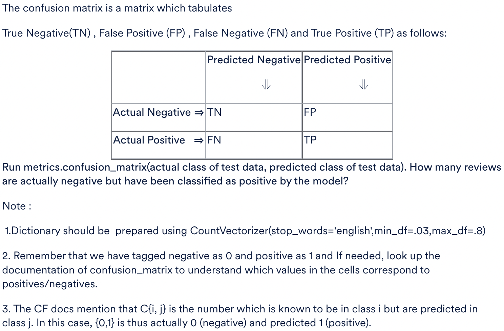
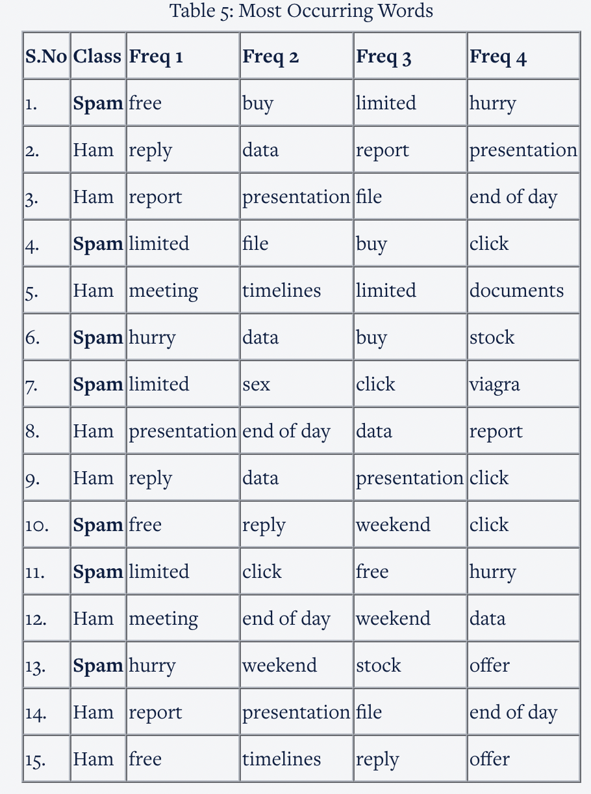
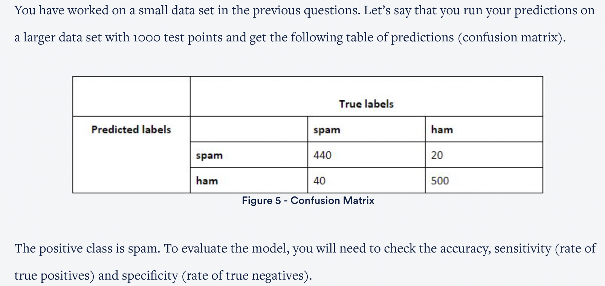
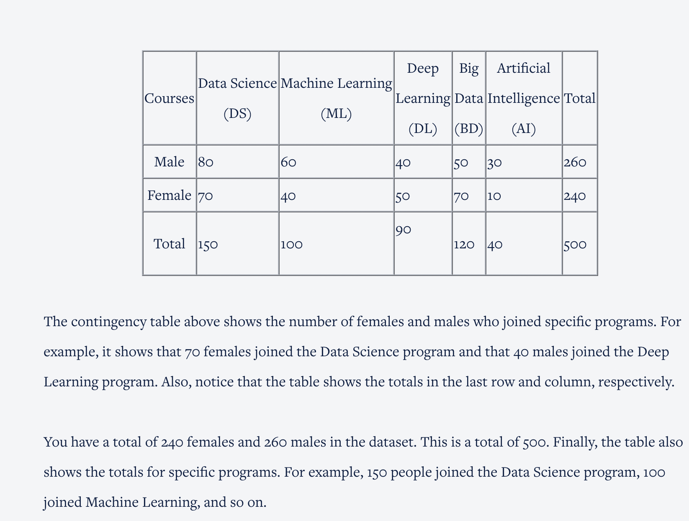

<p>
In this segment, you will use the IMDB movie reviews dataset to classify reviews as 'positive' or 'negative'. We have divided the data into training and test sets. The training set contains 800 positive and 800 negative movie reviews whereas the test set contains 200 positive and 200  negative movie reviews.<br>

This was one of the first widely-available sentiment analysis datasets compiled by Pang and Lee's. The data was first collected in 2002, however, the text is similar to movies reviews you find on IMDB today. The dataset is in a CSV format. It has two categories: Pos (reviews that express a positive or favourable sentiment) and Neg (reviews that express a negative or unfavourable sentiment). For this exercise, we will assume that all reviews are either positive or negative; there are no neutral reviews.<br>

You will need to build a Multinomial Naive Bayes classification model in Python for solving the questions.<br>

Please find the imdb_train dataset <a href="https://ml-course2-upgrad.s3.amazonaws.com/Naive+Bayes/Naive+Bayes+for+Text+Classification/movie_review_train.csv">here</a> and imdb_test dataset <a href="https://ml-course2-upgrad.s3.amazonaws.com/Naive+Bayes/Naive+Bayes+for+Text+Classification/movie_review_test.csv">here</a>.<br>
</p>

<h2>Tag negative(Neg) as 0 and positive(Pos) as 1.</h2>
<hr>
<p>What is the size of vocabulary after removing the stop words? Note that the vocabulary size depends only on the training set.</p><br>
<b>Ans :</b>35858<br>
<b>Explaination:</b><code>dict = CountVectorizer(stop_words='english')
dict.fit(X_train)
X_train_vocabs_dict = dict.get_feature_names()
len(X_train_vocabs_dict)</code>
<hr>
<p>Suppose we don't want to consider those (rare) words which have appeared only in 3% of the documents, or say those (extremely common ones) which have appeared in 80% of the documents.<br>

Use CountVectorizer(stop_words='english', min_df=.03, max_df=.8) to create a new vocabulary from the training set. What is the size of the new vocabulary?</p>
<b>Ans :</b>1643<br>
<b>Explaination:</b><code>vect3 = CountVectorizer(stop_words='english',min_df=.03,max_df=.8)
vect3.fit(X_train)
X_train_vocabs = vect3.get_feature_names()
len(X_train_vocabs)</code>
<hr>
<p>Suppose we build the vocabulary from the training data using CountVectorizer(stop_words='english', min_df=.03, max_df=.8) and then transform the test data using CountVectorizer(). How many nonzero entries are there in the sparse matrix (corresponding to the test data)?</p>
<b>Ans :</b>51663<br>
<b>Explaination:</b><code>vect3 = vect3 = CountVectorizer(stop_words='english',min_df=.03,max_df=.8)
vect3.fit(X_train)
X3_test_fv = vect3.transform(X_test)
X3_test_fv</code>
<hr>
<p>Train a Bernoulli Naive Bayes model on the training set and predict the classes of the test set. Each movie review in the test set has been labelled as 'Pos' or 'Neg'. What is the accuracy of the model?<br>

Note - Dictionary should be prepared using CountVectorizer(stop_words='english', min_df=.03, max_df=.8)</p>
<b>Ans :</b>0.79<br>
<b>Explaination:</b><code>from sklearn.naive_bayes import BernoulliNB

bnb = BernoulliNB()
bnb.fit(X1_train_fv, y_train)
y1_pred_class = bnb.predict(X1_test_fv)

from sklearn import metrics
print(metrics.accuracy_score(y_test, y1_pred_class))</code>
<hr>



<b>Ans :</b>23<br>
<b>Explaination:</b><code>confusion=metrics.confusion_matrix(y_test, y1_pred_class)
print(confusion)</code>
<hr>

<h3>Comprehension - Spam and Ham E-Mails</h3>

<p>Bayesian classifiers are often used for document classification. The words in the documents are used as features for classification. For example, if you want to classify emails as spam or ham (genuine mail), you can use the ‘frequency of words in the text of an email’ as the features. The grammar is disregarded, which means that unimportant words like it, there, the, and etc.  are ignored.<br>

For example, if the main text of an email is:<br>

“Best offers on weight loss fitness bands! Buy this weekend to get a free protein supplement too!! Limited stock, buy now and get free stuff! Hurry up! For more free offers, subscribe on the link below.” <br>

Then the frequently  occurring words i.e. the most important keywords (features) can be counted and stored in a table as shown below. The email above (obviously spam) is shown in the first row of the table. Freq 1 is the most frequent word; Freq 2 is the second most frequent word etc. Also, note that the order of features is important. If the features are (free, report, buy, click), in that order, then ‘free’ is ‘Freq 1’, ‘report’ is Freq 2 and so on. Which means that  (report, free, buy, click) is a different observation from (free, report, buy, click).<br>

The data set with features and class labels is shown below: <br>



Let’s assume a simplified scenario where spammers use only the following important words in their emails:<br>

Spam Keywords: buy, free, hurry, weekend, stock, offer, viagra, sex, limited, click<br>

Also, assume that you are building a model for an organisation where the only important words in genuine (ham) emails are as follows:<br>

Ham Keywords: reply, data, report, presentation, file, end of day, meeting, timelines, delay, documents <br>

Note: Wherever you come across the word independent/independence in this module, conditional independence is implied as discussed in the previous segment "Conditional Independence in Naive Bayes". <br>

<b>Notes:</b>
<ul>
<li>Use the above-given table to answer the following questions.
<li>To Solve the question, you need to very careful with the order of the features, For example: If my given feature list is(free, data, weekend, click) then free is freq1, data is freq2 and so on. Hence the probability of P(free | spam) will be 2/7 and P(click | spam) will be 2/7. 
</ul>

<h3>Prior Probability</h3>
<p>What is the prior probability of a mail being spam, P(class = spam)?</p>
<b>Ans :</b>7/15<br>
<b>Explaination :</b>There are 7 spam mails in the data set.
<hr>

<h3>Naive Bayes Assumption</h3>
<p>What does Naive Bayes assume while classifying spam or ham mails?</p>
<b>Ans :</b>That frequency of keywords like hurry, free, offer etc. are conditionally independent of each other<br>
<b>Explaination :</b>Naive Bayes assumes that the features (frequency of hurry, free etc.) are conditionally independent of each other.
<hr>

<h3>Likelihood Calculation</h3>
<p>Consider an email with the vector of features X = (free, data, weekend, click). What is the likelihood, P(X | spam)?</p>
<b>Ans :</b>4/ 2401<br>
<b>Explaination :</b>P(X | spam) = P(free|spam). P(data|spam). P(weekend | spam). P(click|spam) = (2/7)(1/7)(1/7)(2/7) = 4/2401
<hr>

<h3>Likelihood Calculation</h3>
<p>Consider an email with the vector of features X = (free, data, weekend, click). What is the likelihood, P(X | ham)?</p>
<b>Ans :</b>2/ 4096<br>
<b>Explaination :</b>P(X | ham) = P(free|ham). P(data|ham). P(weekend | ham). P(click | ham) = (1/8)(2/8)(1/8)(1/8) = 2/4096.
<hr>

<h3>Calculating conditional probability</h3>
<p>The value of P(X|Class). P(Class) for class = spam for X = (free, data, weekend, click)?</p>
<b>Ans :</b>(4/2401)(7/15)<br>
<b>Explaination :</b>P(class = spam| X) = P(class = spam). P(X | class = spam) = (7/15)(4/2401).
<hr>

<h3>Posterior Probability</h3>
<p>What is the posterior for class = ham (i.e. without division by denominator) for the feature vector  X = (free, data, weekend, click)?</p>
<b>Ans :</b>(2/4096)(8/15)<br>
<b>Explaination :</b>P(class = ham| X) = P(class = ham). P(X | class = ham) = (8/15)(2/4096).
<hr>

<h3>Classifying a test point</h3>
<p>Which class should be point X = (free, data, weekend, click) be classified into?</p>
<b>Ans :</b>Spam<br>
<b>Explaination :</b>The (numerators of) posteriors, P(Class | X) for spam and ham are respectively (7/15)(4/2401) and (8/15)(2/4096), spam's being higher.
<hr>



<p>What is the accuracy of the model?</p>
<b>Ans :</b>940/1000<br>
<b>Explaination :</b>440 + 500 points are classified correctly.
<hr>

<p>What is the sensitivity of the model?</p>
<b>Ans :</b>440 / 480<br>
<b>Explaination :</b>440 out of 480 spams have been classified correctly.
<hr>

<p>What is the specificity of the model?</p>
<b>Ans :</b>500 / 520<br>
<b>Explaination :</b>The fraction of correctly predicted hams = 500 / (500 + 20).
<hr>

<p>Given that you do not want to misclassify any genuine emails, which metric should be as high as possible?</p>
<b>Ans :</b>Specificity<br>
<b>Explaination :</b>Fraction of correctly classified hams is measured by specificity (true negative rate).
<hr>



<p>Given this contingency table, what is the probability that a randomly selected person joined Data Science?</p>
<b>Ans :</b>150/500<br>
<b>Explaination :</b>The table shows you that 150 people joined Data Science out of the total 500 people who are part of the data.

Therefore, P(Person who joined DS) = 150/500 = .3 (or 30%).
<hr>

<p>Given this contingency table, what is the probability that a randomly selected female joined DS? In other words, what is the probability of a person joining DS, GIVEN that she is female?</p>
<b>Ans :</b>70/240<br>
<b>Explaination :</b>The table shows you that 70 females joined DS out of the total 240 females in the dataset. 

P( DS | Female) = 70/240 = .29166 or 29.16%
<hr>

<p>Consider a set containing all DL students OR all male students. What is the Probability that a randomly selected person will belong to this set?<br>

Hint: Use the formula: (A or B) = p(A) + p(B) – p(A and B)</p>
<b>Ans :</b>310/500<br>
<b>Explaination :</b>This question deals with a probability concept called the ‘OR’. There is a formula for OR, which is — P(A OR B) = P(A) + P(B) – P(A AND B)<br>

In this example, you’re looking at two things: DL and Male.<br>

So, the question asked is —P(DL OR Male) = P(DL) + P(Male) – P(DL AND Male)<br>

Using the table in the question description, you see that —P(DL) = 90/500<br>

P(Male) = 260/500<br>

P(DL AND Male) = 40/500<br>

Therefore ...<br>

P(DL OR Male) = P(DL) + P( Male) – P(DL AND Male)<br>

= 90/500 + 260/500 – 40/500 = (90 + 260 – 40)/500 = 310/500 = .62 or 62%<br>

**Now, why do you subtract the probability of (Male and DL)? The answer is that when you count all the males and then count all the people who joined DL, there is an overlap because some males joined DL. This means you counted them twice, and so you have to subtract the extra count.
<hr>

<p>What is the probability of a student being a female AND an AI student? Hint: Use the formula: P(A AND B) = P(A | B) * P(B) </p>
<b>Ans :</b>10/500<br>
<b>Explaination :</b>Here, the question is asking for P(Female AND AI).<br>

P(A AND B) = P(A | B) * P(B)<br>

This is read as the probability of A GIVEN B times the probability of B. When A and B are INDEPENDENT, P(A AND B) = P(A | B) * P(B) = P(A) * P(B).<br>

Here, P(Female | AI Student) = 10/40. i.e. If you know that 40 students are AI students, then 10 of them are female.<br>

P(AI Student) = 40/500<br>

Therefore, P(Female AND AI Student) = P(Female | AI Student) * P(AI Student) = 10/40 * 40/500 = 10/500 = .02 or 2%.<br>

You can also do this directly from the table, without the formula:<br>

P( Female AND AI Student) = 10/500 = .02 or 2%<br>

The two answers are identical, and there are just two ways to solve the question.<br>
<hr>

<p>What is the probability of a Deep Learning (DL) student being a male?</p>
<b>Ans :</b>40/90<br>
<b>Explaination :</b>Question is asking to determine P(M|DL). We know from the chain rule that<br>

P(A and B) = P(A|B)*P(B)<br>

Therefore P(A|B) = P(A and B) / P(B)<br>

Now from the given table P(M and DL) = 40/500  and P(DL) = 90/500.<br>

So P(M|DL) = P(M and DL)/P(DL) = (40/500)/(90/500) = 40/90.<br>

In fact we didn't need to do all these.<br>

As soon as we are talking about only DL students, we are talking about only 90 students. Now what is the probability of any student from this 90 students being a male. As there are 40 males in these 90 students, the probability of selecting a male is 40/90.
<hr>

Naive Bayes is a probabilistic machine learning model based on Bayes' Theorem. It assumes that the features used for prediction are independent (hence "naive") and calculates the probability of each class given the features. There are different types of Naive Bayes models depending on the type of features (continuous or binary). Two common variants are **Gaussian Naive Bayes** and **Bernoulli Naive Bayes**, each based on different probability distributions.

### 1. **Gaussian Naive Bayes**
   - **Assumption**: Features are continuous and are normally distributed (i.e., follow a Gaussian distribution).
   - **Use case**: This variant is best used when the data consists of continuous numeric features.
   - **Formula**: The Gaussian Naive Bayes classifier calculates the probability using the Gaussian distribution formula:
     \[
     P(X_i | C) = \frac{1}{\sqrt{2 \pi \sigma^2}} \exp\left(\frac{-(X_i - \mu)^2}{2\sigma^2}\right)
     \]
     where:
     - \( \mu \) is the mean of feature \( i \) for class \( C \),
     - \( \sigma \) is the standard deviation of feature \( i \) for class \( C \),
     - \( X_i \) is the value of the feature for a given instance.

### 2. **Bernoulli Naive Bayes**
   - **Assumption**: Features are binary (0 or 1).
   - **Use case**: This variant is typically used when the features represent binary outcomes (e.g., presence or absence of a feature).
   - **Formula**: The Bernoulli Naive Bayes classifier computes the probability based on the Bernoulli distribution:
     \[
     P(X_i = 1 | C) = p_i^1, \quad P(X_i = 0 | C) = 1 - p_i
     \]
     where:
     - \( p_i \) is the probability of feature \( i \) being 1 (present) for class \( C \).

### **Building Naive Bayes Model in Python (using Scikit-learn)**

#### Example with Gaussian Naive Bayes:

```python
# Import necessary libraries
from sklearn.model_selection import train_test_split
from sklearn.naive_bayes import GaussianNB
from sklearn.metrics import accuracy_score
from sklearn.datasets import load_iris

# Load dataset
data = load_iris()
X = data.data
y = data.target

# Split the dataset into training and testing sets
X_train, X_test, y_train, y_test = train_test_split(X, y, test_size=0.3, random_state=42)

# Initialize the Gaussian Naive Bayes model
gnb = GaussianNB()

# Train the model
gnb.fit(X_train, y_train)

# Predict on the test set
y_pred = gnb.predict(X_test)

# Calculate accuracy
accuracy = accuracy_score(y_test, y_pred)
print(f"Accuracy of Gaussian Naive Bayes: {accuracy * 100:.2f}%")
```

#### Example with Bernoulli Naive Bayes:

```python
# Import necessary libraries
from sklearn.naive_bayes import BernoulliNB
from sklearn.metrics import accuracy_score
from sklearn.datasets import load_digits
from sklearn.model_selection import train_test_split

# Load dataset (using binary features here)
data = load_digits()
X = data.data
y = data.target

# Convert features to binary (for Bernoulli Naive Bayes)
X_bin = (X > 8).astype(int)

# Split the dataset into training and testing sets
X_train, X_test, y_train, y_test = train_test_split(X_bin, y, test_size=0.3, random_state=42)

# Initialize the Bernoulli Naive Bayes model
bnb = BernoulliNB()

# Train the model
bnb.fit(X_train, y_train)

# Predict on the test set
y_pred = bnb.predict(X_test)

# Calculate accuracy
accuracy = accuracy_score(y_test, y_pred)
print(f"Accuracy of Bernoulli Naive Bayes: {accuracy * 100:.2f}%")
```

### **Key Differences:**

- **Gaussian Naive Bayes** is more suited to problems where your features are continuous and follow a normal distribution, like predicting house prices based on continuous variables (e.g., area, number of rooms).
- **Bernoulli Naive Bayes** is ideal for text classification tasks, such as spam email classification, where features (words) are binary, indicating the presence or absence of a word in a document.

Both models assume feature independence given the class label and use Bayes' theorem to update probabilities based on observed data.

### **Choosing Between Gaussian and Bernoulli Naive Bayes:**
- If the data consists of continuous numeric features, use **Gaussian Naive Bayes**.
- If the features are binary or represent the occurrence of events, use **Bernoulli Naive Bayes**.

You can use **Cross-validation** and **GridSearchCV** for hyperparameter tuning and to determine the optimal model based on your dataset.

For more details, refer to:
- [Gaussian Naive Bayes in Scikit-learn](https://scikit-learn.org/stable/modules/generated/sklearn.naive_bayes.GaussianNB.html)
- [Bernoulli Naive Bayes in Scikit-learn](https://scikit-learn.org/stable/modules/generated/sklearn.naive_bayes.BernoulliNB.html)