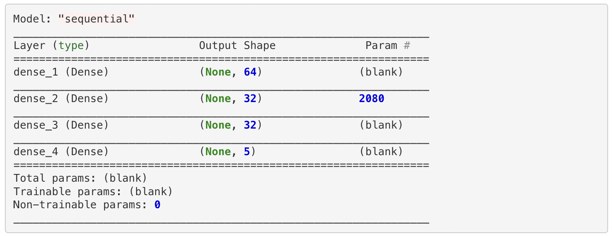
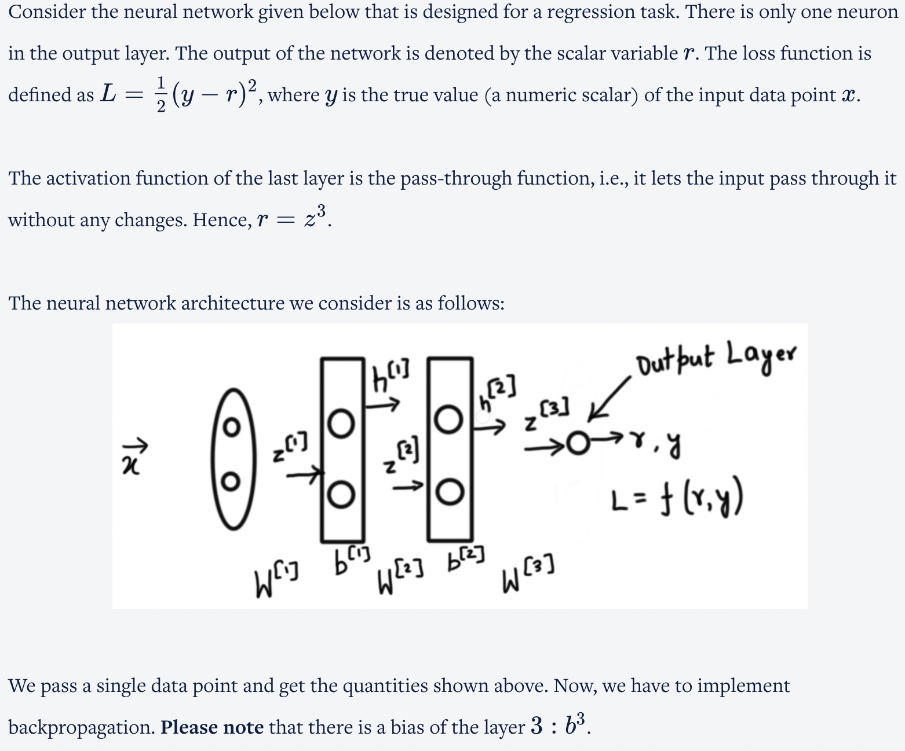
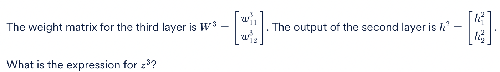
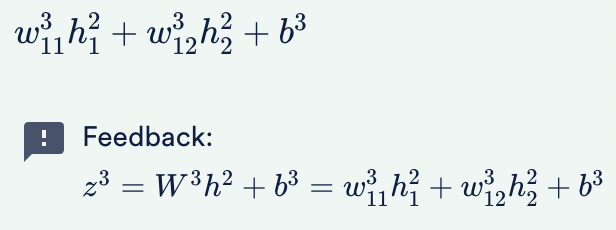
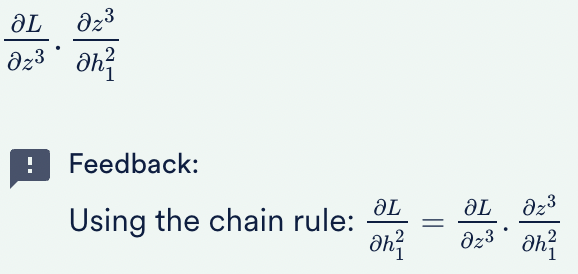
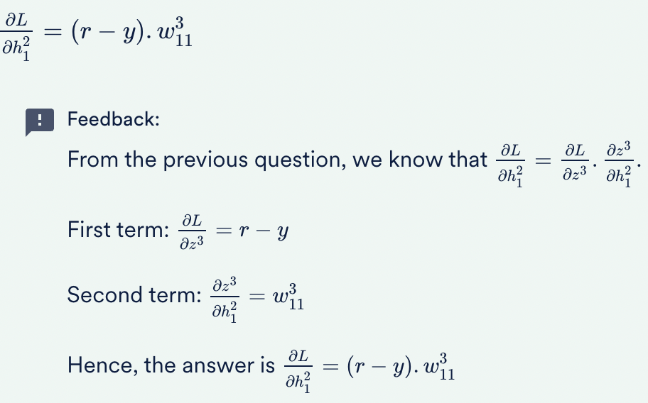
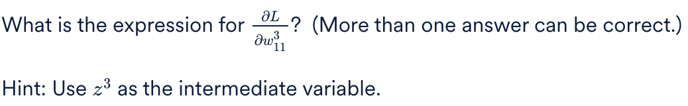
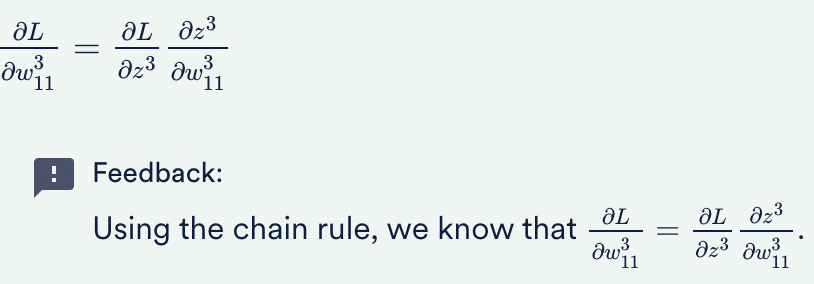
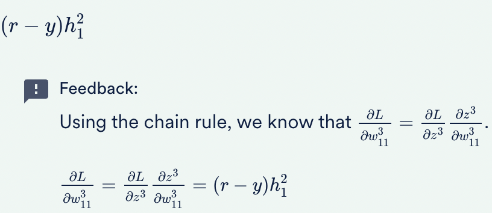
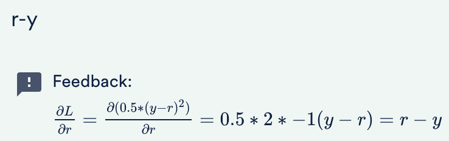

Consider a neural network with 5 hidden layers. Choose the options that are correct for feedforward propagation.

<b>Ans :</b>
<ul>
<li>The output of the third hidden layer can be calculated only after the output of the second hidden layer is computed in one feed forward pass. 
In feed forward, the output of the layer 'l' can be calculated only after the calculation of the output of all the 'l-1' layers.
<li>The output of the fifth hidden layer can be calculated only after the output of the second hidden layer is computed in one feed forward pass. 
In feed forward, the output of the layer 'l' can be calculated only after the calculation of the output of all the 'l-1' layers.
</ul>

Consider a neural network with 5 hidden layers. You feed an input batch of 20 data points into the network. How will you denote the weight matrix between the hidden layers 4 and 5?

<b>Ans :</b>W^5 
<b>Explaination :</b>W^l is the weight matrix between the layers l and l-1.

Consider a neural network with 5 hidden layers. You feed an input batch of 20 data points into the network. The weight matrix W^3 has the dimensions (18,12). How many neurons are present in the hidden layer 2?

<b>Ans :</b>12 
<b>Explaination :</b>Weight matrix dimensions = (Number of neurons in the layer l, Number of neurons in layer 'l-1')

<h3>Basic Hyperparameters of Neural Network</h3>

The hyperparameters in a neural network are ________. (Note: More than one option may be correct.)

<b>Ans :</b>
<ul>
<li>The number of layers 
Weights and biases are parameters to be found by training the learning algorithm. The number of layers is one of the predefined hyperparameters.
<li>The number of neurons in each layer 
Weights and biases are parameters to be found by training the learning algorithm. The number of neurons is one of the predefined hyperparameters.
</ul>

<h3>Inputs</h3>

Suppose you want to classify an RGB image with an input of 32 x 32 pixels as ‘dog’, ‘cat’, ‘bird’ or ‘none of the above’. How many neurons will the input layer have?

<b>Ans :</b>3072 
<b>Explaination :</b>A black-and-white 32 x 32 image will have 32 x 32 input neurons. However, since an RGB image has 3 channels, the network will have 32 * 32 * 3 = 3072 input neurons.

<h3>Outputs</h3>

Suppose you want to classify an RGB image with an input of 32 x 32 pixels as ‘dog’, ‘cat’, ‘bird’ or ‘none of the above’. How many neurons will the output layer have?

<b>Ans :</b>4 
<b>Explaination :</b>Since there are 4 classes,i.e., ‘dog’, ‘cat’, ‘bird’ and ‘none of the above’, we will have 4 output neurons.

<h3>Output layer</h3>

Suppose you want to classify an RGB image with an input of 32 x 32 pixels as ‘dog’, ‘cat’, ‘bird’ or ‘none of the above’. Would you use a sigmoid/ softmax layer as the output layer?

<b>Ans :</b>Softmax 
<b>Explaination :</b>Since there are 4 classes, we would use a softmax function in the output layer.

<h3>Notations</h3>

How would you denote the output of the third hidden layer?

<b>Ans :</b>h^3 
<b>Explaination :</b>The output of a hidden layer is denoted by h. The superscript denotes the layer number. Hence h^3 is the correct answer. Note: Since a specific neuron is not mentioned, we do not have a subscript.

How would you denote the weight that connects the sixth neuron of the hidden layer 3 to the eighth neuron of the hidden layer 4?

<b>Ans :</b>w^4v86 
<b>Explaination :</b>Here, the notation w^4
 indicates the weights for the fourth hidden layer because the superscript is 4. Also, in the subscript, we have the neuron of the 
lth layer, i.e., 8 as the first number and the neuron of the (l−1)th layer, i.e., 6 as the second number. Since this is the case, the answer is correct.

<h3>Number of Interconnections</h3>

We have the hidden layer number 3 with 11 neurons and the hidden layer number 4 with 18 neurons. Also, these hidden layers are densely connected. How many connections will be there between the two hidden layers?

<b>Ans :</b>198 
<b>Explaination :</b>Number of interconnections = Number of neurons in layer l x Number of neurons in layer (l−1)
                                                                   = 11 * 18 = 198

<h3>Assumptions of Neural Network</h3>

State whether the following statement is true or false. 

According to the assumptions of neural networks, the activation function of all the neurons in one particular layer is the same.

<b>Ans :</b>True 
<b>Explaination :</b>All neurons in a particular hidden layer use the same activation function. Hence, this answer is correct.

A model summary is given below for neural network architecture.

The input data vector has 1000 features. The dense_4 layer is the output layer. 

Notice that there are blanks filled in different places. Let’s answer a few questions to know each of the values. 

What is the number of parameters in the third dense hidden layer?

<b>Ans :</b>1056 
<b>Explaination :</b>The number of parameters is the total number of weights and biases. The third hidden dense layer has 32 neurons and each neuron will have a bias term. Thus, 32 elements are present in the bias vector for the third hidden layer. The weight matrix is between the second layer with 32 neurons and the third layer with 32 neurons. Hence, the weight matrix will have 32*32=1024 elements. Adding the bias terms, in total, there are 32+1024=1056 parameters.

A model summary is given below for neural network architecture.

The input data vector has 1000 features. The dense_4 layer is the output layer. 

Notice that there are blanks filled in different places. Let’s answer a few questions to know each of the values. 

Calculate the number of weights in the weight matrix for the first dense hidden layer.

<b>Ans :</b>64000 
<b>Explaination :</b>As the input has 1000 features and the first dense hidden layer has 64 neurons, the weight matrix will have 64*1000 = 64000 elements in it

A model summary is given below for neural network architecture.

The input data vector has 1000 features. The dense_4 layer is the output layer. 

Notice that there are blanks filled in different places. Let’s answer a few questions to know each of the values. 

Find the number of parameters for the output layer.

<b>Ans :</b>165 
<b>Explaination :</b>The number of parameters is the total number of weights and biases. Since the output layer has 5 neurons, each one will have a bias term, thus, 5 elements are there in the bias vector of the output layer. The weight matrix is between the third layer with 32 neurons and the output layer with 5 neurons. Hence, the weight matrix will have 32*5=160 elements. Adding the bias terms to the weights, in total, there are 5+160=165 parameters.

A model summary is given below for neural network architecture.

The input data vector has 1000 features. The dense_4 layer is the output layer. 

Notice that there are blanks filled in different places. Let’s answer a few questions to know each of the values. 

Find the total number of trainable parameters.

<b>Ans :</b>67365 
<b>Explaination :</b>The total number of trainable parameters is the total number of parameters in the model. It’s value is 64064+2080+1056+165 = 67365.

<h3>Learning in Neural Network</h3>

A neural network learns by adjusting the weights and biases so that the loss is minimised. When does ‘learning’ in a neural network happen?

<b>Ans :</b>Backpropagation 
<b>Explaination :</b>The ‘learning’ in a neural network is the adjustment of weights and biases. This happens during backpropagation. The network does not change (learn) during feedforward.

<h3>Gradient Calculations</h3>

Which of the following statements about the gradient calculation of loss L with respect to the weights W of different layers in a neural network is correct?

<b>Ans :</b>The gradient of L with respect to layer l−1 is calculated using the gradient with respect to layer l. 
<b>Explaination :</b>The gradients are calculated using backpropagation, i.e., the gradient of L with respect to layer l−1 is calculated using the gradient with respect to layer l.

<h3>Weights and Biases</h3>

What happens in a single forward-backward pass through the network?

<b>Ans :</b>The weights and biases of all the layers get updated 
<b>Explaination :</b>In each iteration, we calculate the loss and update the weights and biases of every layer to minimise the loss in each iteration.

<h3>Weight Matrix</h3>

What is the dimension of W^3?

<b>Ans :</b>(1,2) 
<b>Explaination :</b>The dimension of W^l = (number of neurons in layer l, number of neurons in layer l-1).

<h3>Weight Matrix 2</h3>

<b>Ans :</b>

<h3>Compute gradient of the loss function with respect to cumulative input</h3>

<b>Ans :</b>

<b>Ans :</b>

<b>Ans :</b>
<ul>
<li>

<li>

</ul>

<h3>Backpropagation</h3>

<b>Ans :</b>

