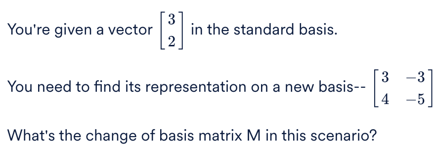
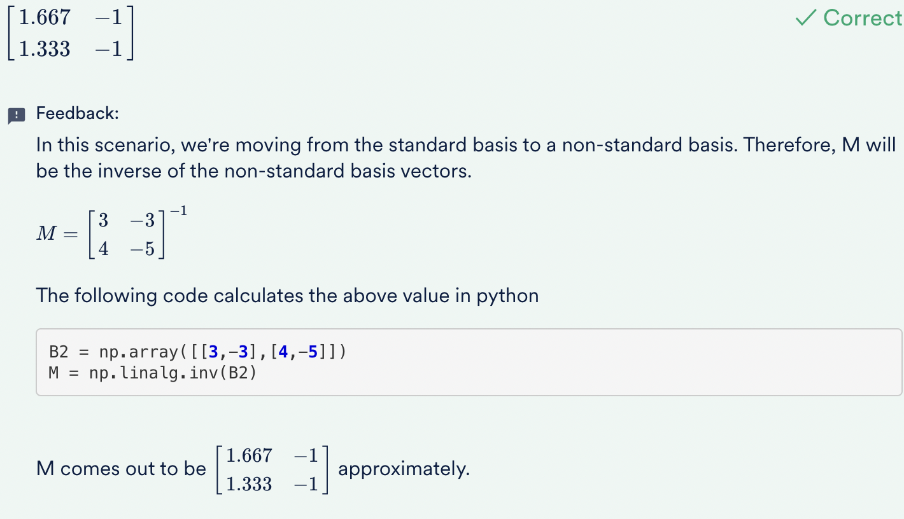

Which of the following preprocessing steps is the most crucial before performing PCA?
<b>Ans :</b>Standardisation of data
<b>Explaination :</b>If variables are on a different scale (e.g. fractions and millions), then PCA (while trying to maximise the variance) will give higher importance to the variables with high variance simply because of scale. For example, if you change one variable from km to cm (increasing its variance), it may go from having little impact to dominating the first.

<h3>Change in Basis</h3>

<b>Ans :</b>

<h3>Find the new representation</h3>

<b>Ans :</b>

<h3>PCA - Properties</h3>

Consider the following statements 

Statement 1 - PCA helps in solving the multicollinearity problem by creating new uncorrelated features which are used as input for the predictive model. 

Statement 2 - With a dimensionality reduction technique like PCA, you convert a dataset having N dimensions to another dataset having k dimensions where N > k. 

Now choose the correct option. 

<b>Ans :</b>Both the statements are correct 
<b>Explaination :</b>PCA does create uncorrelated features which solve the problem of multicollinearity. PCA also reduces the number of dimensions from N to k (or N > k )

