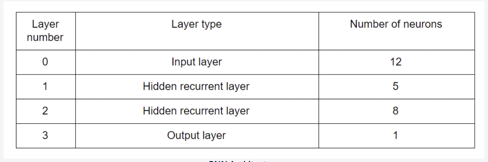

Which of the following is the correct order if you arrange RNNs according to the network training time?

<b>Ans :</b>Bidirectional LSTM > LSTM > GRU > Vanilla RNN 
<b>Explaination :</b>The time it takes to train an RNN corresponds to the number of parameters present an architecture. If a vanilla RNN has 'n' number of parameters then the number of parameters a GRU, LSTM and bidirectional LSTM are 3n, 4n and 8n, respectively.

Keras accepts batch dimensions of the input data in which of the following formats?

<b>Ans :</b>(#samples, #timesteps, #features)

In which of the following RNN types, you don't use a TimeDistributed() layer at the output?

<b>Ans :</b>Many-to-one 
<b>Explaination :</b>You only use a TimeDistributed() layer when the RNN outputs output a sequence. Therefore, you don't use it in a many-to-one RNN model.

<h3>Bidirectional RNNs</h3>

Which of the following applications can bidirectional RNNs be used for? More than one options may be correct.

<b>Ans :</b>
<ul>
<li>Speech recognition - given a set of audio files, transcribing them into text in the same language 
The entire audio file is given to the network, so it can look ahead in time and use both the forward and backward contexts.
<li>Machine translation - given a set of English sentence, translating it to another language such as French or Hindi. 
The entire sentence is given to the network, so it can look ahead.
</ul>

Which of the following is not a feature of an LSTM cell?

<b>Ans :</b>An LSTM cell replaces an entire RNN layer 
<b>Explaination :</b>An LSTM is similar to an RNN layer except that the RNN cells are replaced with LSTM cells.

Which of the following functions are present in the update gate of an LSTM cell?

<b>Ans :</b>A sigmoid and a tanh function 
<b>Explaination :</b>The update gate in an LSTM cell has one sigmoid function and one tanh function. 
LSTM cell has more parameters than a vanilla RNN cell 
You can build an RNN network with multiple LSTM layers. 
Only the forget and the update gate are responsible for the new cell state ct of a cell in an LSTM cell. 
Bidirectional RNNs can only be built in case of offline sequences where the sequences are already available.

<h3>The LSTM Cell</h3>

The LSTM cell is able to solve the problem of vanishing gradients because (only one option is correct):

<b>Ans :</b>The gradient is propagated from the cell state ct to the previous cell state ct−1 without any weights involved directly between ct and ct−1 which ensures that at least some gradient is always propagated backwards in time 

Suppose you’re building a sentiment classifier based on users’ reviews on a product. The model is expected to predict a numeric ‘sentiment score’ for each review. Which of the following RNN architectures will be most suitable for this kind of problem?

<b>Ans :</b>Many-to-one architecture 
<b>Explaination :</b>The input, a review, is a sequence of words and the output, the sentiment label, is a single entity. Hence, this architecture will be most suitable in this case.

<h3>A Many-to- One RNN</h3>

Consider a many-to-one recurrent neural network with 20 timesteps and a batch size of 32 (batch size refers to the number of sequences fed into the network in one iteration). The network architecture is as follows:

What is the size of W^2vR?

<b>Ans :</b>(8, 8) 
<b>Explaination :</b>We know that the W^lvR is of size (#neurons at layer l, #neurons at layer l). The second hidden layer has 8 neurons. Therefore, its dimension is (8, 8).

What is the size of a^1v8?

<b>Ans :</b>(5, 32) 
<b>Explaination :</b>We know that the a^lvt is (#neurons at layer l, #batch_size). The first hidden layer has 5 neurons and the batch size is 32. Therefore, its dimension is (5, 32) 
The size of a^2v3 is larger than the size of a^2v10. Size of both a^2v3 and a^2v10 is (8, 32).

Suppose you change the batch size from 32 to 128. Which of the following matrix sizes will be affected by this change?

<b>Ans :</b>a^2v20 
<b>Explaination :</b>The size of a^2v20 will change to (8, 128) from (8, 32) after changing the batch size.

