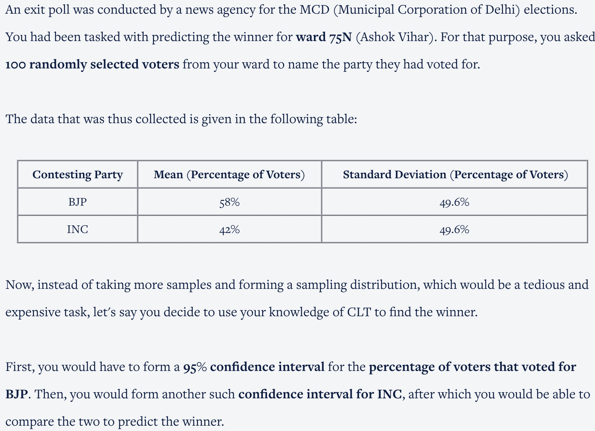
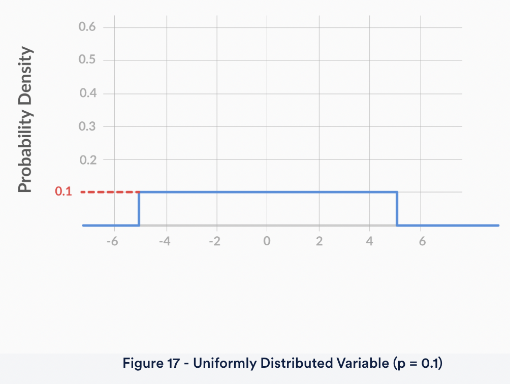
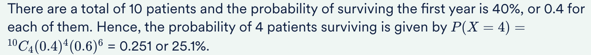
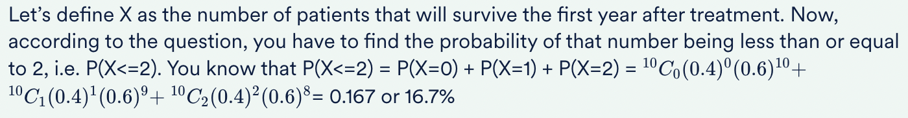
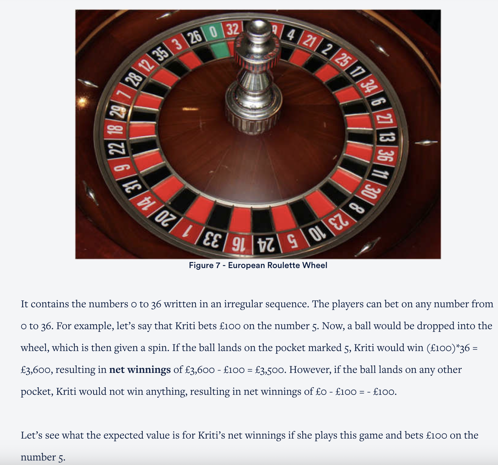

<h3>Exit Poll Confidence Interval</h3>

So, you define X as the proportion of people that voted for BJP. Now, for a 95% confidence interval, what would be the value of the MOE (margin of error)?

<b>Ans :</b>9.72% 
<b>Explaination :</b>The margin of error = Z∗S/√n. From the data given above, you know that S = 49.6% or 0.496 and n = 100. The value of Z* corresponding to 95% confidence is 1.96. So, the margin of error = 1.96∗0.496/√100 = 0.0972, or 9.72%

What would the 95% confidence interval be for X, the proportion of people that voted for BJP?

<b>Ans :</b>(48.28%, 67.72%) 
<b>Explaination :</b>Recall that the margin of error = 9.72% and the sample mean ¯X = 58%. So, the confidence interval is (58%-9.72%, 58%+9.72%)

What would the 95% confidence interval be for Y, the proportion of people that voted for INC?

<b>Ans :</b>(32.28%, 51.72%) 

Thus, with 95% confidence, we can Not make any claims regarding the election results for ward 75N because The percentage of voters that voted for BJP, falls within the interval (48.28%, 67.72%). The interval for the percentage of voters that voted for INC is (32.28%, 51.72%). Hence, anything is possible. It is possible that BJP gets 67.72% of the votes and wins the election, but it is also possible that INC could get 51.72% of the votes and win the election for ward 75N. Hence, you cannot decide the winner based on this information.

The graph you see above represents the PDF of a uniformly distributed random variable X. As you can see, the probability density is equal for all the possible values of X (-5 to +5).

What is the probability of the random variable X lying between -1.5 and +2.5, i.e. P(-1.5<X<2.5)?

<b>Ans :</b>0.4 
<b>Explaination :</b>The probability of the variable lying between -1.5 and 2.5 would be equal to the area under the PDF, between X = -1.5 and X = 2.5. This would be equal to the area of a rectangle, with breadth 0.1 and length 2.5 - (-1.5) = 4. Multiplying the two, you get the area of the rectangle, which is equal to 0.1*4 = 0.4.

The normal distribution, aka the Gaussian distribution, was discovered by Carl Friedrich Gauss in 1809. Gauss was trying to create a probability distribution for astronomical errors. Astronomical errors are the errors that were made by astronomers while observing phenomena such as distances in space. 

For example, Gauss found that an astronomer trying to estimate the distance between Earth and Uranus always makes an error. This error is normally distributed, with µ = 0 km and σ = 1,000 km.

Based on the information above, what is the probability of the astronomer overestimating the distance by 2,330 km or more?

<b>Ans :</b>1% 
<b>Explaination :</b>Let’s define X as the astronomical error, which is normally distributed with mean 0 km and standard deviation 1,000 km. Now, you have to find the probability that X > 2330, i.e. P(X>2330). Converting this to Z, it becomes P(Z>2.33). Since P(Z<=2.33) + P(Z>2.33) = 1, P(Z>2.33) = 1 - P(Z<2.33) = 1 - 0.9901 = 0.0099 or 0.99%, which is approximately 1%.

Hence, what is the probability that the astronomer under- or over-estimates the distance by less than 500 km?

<b>Ans :</b>38.30% 
<b>Explaination :</b>Let’s define X as the astronomical error, which is normally distributed with mean 0 km and standard deviation 1,000 km. Now, you have to find the probability that -500 < X < 500, i.e. P(-500 < X < 500). Converting this to Z, it becomes P(-0.5 < Z < 0.5) = P(Z < 0.5) - P(Z < -0.5) = 0.6915 - 0.3085 = 0.3830, or 38.30%.

Suppose a new cancer treatment has been discovered, claiming to increase the one year survival rate for pancreatic cancer to 40%. In other words, the probability that a patient suffering from pancreatic cancer would survive for at least one year after receiving this treatment is 40%. 

Suppose a  hospital is planning to use this treatment for its pancreatic cancer patients.

The hospital has a total of 10 patients suffering from pancreatic cancer. What is the probability that exactly 4 of these patients would survive the first year after receiving this treatment?

<b>Ans :</b>25.1% 
<b>Explaination :</b>

What is the probability that the number of patients that survive the first year after receiving the treatment would not be more than 2?

<b>Ans :</b>16.7% 
<b>Explaination :</b>

<h3>European Roulette Wheel</h3>

First of all, what is the probability of Kriti winning the game if she bets on the number 5?

<b>Ans :</b>1/37 
<b>Explaination :</b>There are a total of 37 equally likely possibilities (0 to 36). However, there is only one possibility in which Kriti will win, i.e. the one in which the ball would land on the pocket marked 5. Hence, the probability of her winning the game is 1/37.

Now, let’s say that we define the random variable X as Kriti’s net winnings if she plays this game and bets £100 on the number 5. What is the expected value of X?

<b>Ans :</b>-£2.70 
<b>Explaination :</b>There are two possible values of X, 3,500 and -100. The probability of Kriti’s net winnings being 3,500 is basically the probability of her winning the game, which, as we saw in a previous question, is 1/37. The probability of her net winnings being equal to -100 is basically the probability of her losing the game, which is 36/37. So, the expected value of X = P(X=-100)*(-100) + P(X=3500)*3500 = (36/37)*(-100)+(1/37)*(3500) = -2.70.

<h3>American Roulette Wheel</h3>

Now, again, let’s define the random variable X as Kriti’s net winnings if she plays this game and bets £100 on the number 5. What is the expected value of X this time?

<b>Ans :</b>-£5.26 
<b>Explaination :</b>Again, there are two possible values of X, 3,500 and -100. However, this time, the probability of Kriti’s net winnings being 3,500 is 1/38, as there are a total of 38 possible outcomes. The probability of her net winnings being equal to -100, basically the probability of her losing the game, is now 37/38. So, the expected value of X = P(X=-100)*(-100) + P(X=3500)*3500 = (37/38)*(-100)+(1/38)*(3500) = -5.26.

