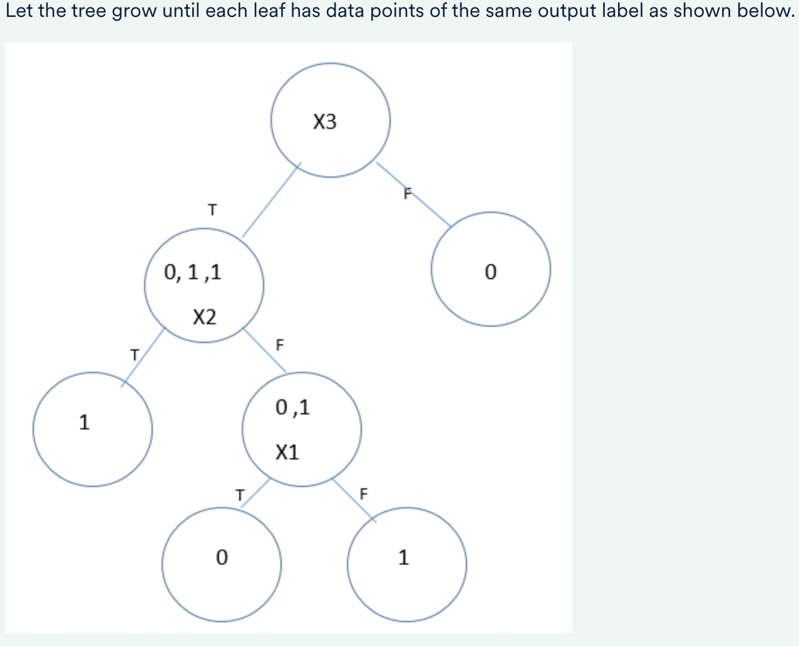

<h3>Gini Index</h3>

What is the Gini index of the complete data in the training set?

<b>Ans :</b>0.5 
<b>Explaination :</b>There are two class labels in the training data. So the Gini index will be equal to <b>pyes(1−pyes) + pno(1−pno)</b> 

The probability of class label 1 = (15/30) = 0.5, and the probability of class label 2 = (15/30) = 0.5.  

Hence, you get Gini = 0.5(1-0.5) + 0.5(1-0.5) = 0.5.

<b>Ans :</b>4/9 
<b>Explaination :</b>Calculate Gini impurity as p0(1-p0) + p1(1-p1). Out of 6 instances Yes=4 (Y=1) and No=2(Y=0) . Hence, Gini = (4/6) x (2/6) + (2/6) x (4/6) = 16/36 = 4/9. 

Consider the above table of 6 observations. Values of X1 and X2 are used to predict the outcome Y. When Y is 1 the outcome is considered to be positive.  

Now, instead of 2.5, if the splitting value of X2 is chosen as 1.5 then what is the Gini impurity of the split data?

<b>Ans :</b>5/12 
<b>Explaination :</b>

<h3>Gini Impurity</h3>

Consider the above table of 6 observations. Values of X1 and X2 are used to predict the outcome Y. When Y is 1 the outcome is considered to be positive.  

If in the process of making a decision tree X2 is considered as splitting feature and 2.5 is considered as splitting value and values less than 2.5 go to the left node. What will the Gini impurity of the split data be?

<b>Ans :</b>1/3 
<b>Explaination :</b>

What is the Gini index of the partitions if you split the training set on a1, i.e., average delivery rating. Here, take the condition to be a1 < 3. (Note: You go left if a1 is less than 3, and you go right if a1 is greater than or equal to 3.)

<b>Ans :</b>106/225 
<b>Explaination :</b>

<h3>Attribute Selection</h3>

Which attribute will you split the training data on?  

Note: Find the Gini index for both cases and then decide the split.

<b>Ans :</b>Average Orders per Month: (a2) < 20 
<b>Explaination :</b>The Gini index (a2 < 20) ≈ 0.32, and the Gini index(a1 < 3) ≈ 0.50. Since Gini index (a2 < 20) < Gini index(a1 < 3), you split on a2.

<h3>Splitting</h3>

<b>Ans :</b>No. One of the leaves will have only 4 data points upon splitting, which is less than the min_samples_leaf (=5). 
<b>Explaination :</b>This split violates the 'minimum number of data points that a leaf should have on splitting' condition put up by the min_samples_leaf.

<b>Ans :</b>0.09 
<b>Explaination :</b>

<b>Ans :</b>The number of data points in this node is less than the min_samples_split. 
<b>Explaination :</b> The number of data points in this node is 6. The value of the minsplit, as specified at the beginning, is 10.

<h3>Homogeneity</h3>

<b>Ans :</b>The right partition is completely homogeneous. 
<b>Explaination :</b>All the data points belong to the class label "No". There is no data point in the right leaf that belongs to the class label "Yes".

<h3>Decision Trees</h3>

If we train a decision tree with the above data what feature will we split on at the root?

<b>Ans :</b>X3 
<b>Explaination :</b>

If we fully train the decision tree using the root feature (as the answer of the previous question) until each leaf has data points of the same output label (i.e., all leaf nodes will be completely homogenous), what will be the depth of that tree?

<b>Ans :</b>3 
<b>Explaination :</b>

After fully training the tree in the previous question what is the training error of the decision tree?

<b>Ans :</b>0 
<b>Explaination :</b>

<h3>Interpreting a Decision Tree</h3>

How many leaf nodes in this tree have been classified as "No Disease"?

<b>Ans :</b>4 
<b>Explaination :</b>If you take a look at the tree and look for the yellow-coloured leaf nodes, you will see that 4 leaf nodes have been classified as 'No Disease'.

Now, if a person less than age 54.5 has been classified as "Disease", it would mean that ______. (More than one option may be correct). 

Note: Assume that sex = 0 represents female and sex = 1 represents male.

<b>Ans :</b>
<ul>
<li>The person's age will be less than 40.5. 
The person is aged less than 54.5 according to the question. This means that we only need to look at the left part of the decision tree. If you check the leaf nodes which have been classified as 'Disease' and trace the features back up to check which conditions are satisfied, you will see that the for this node, the conditions age <=40.5 was true meaning the person has to be younger than 40.5. Also, the condition sex <=0.5 was false meaning the person was a male since 0 represents female and 1 represents male.
<li>The person is male. 
The person is aged less than 54.5 according to the question. This means that we only need to look at the left part of the decision tree. If you check the leaf nodes which have been classified as 'Disease' and trace the features back up to check which conditions are satisfied, you will see that the for this node, the conditions age <=40.5 was true meaning the person has to be younger than 40.5. Also, the condition sex <=0.5 was false meaning the person was a male since 0 represents female and 1 represents male.

